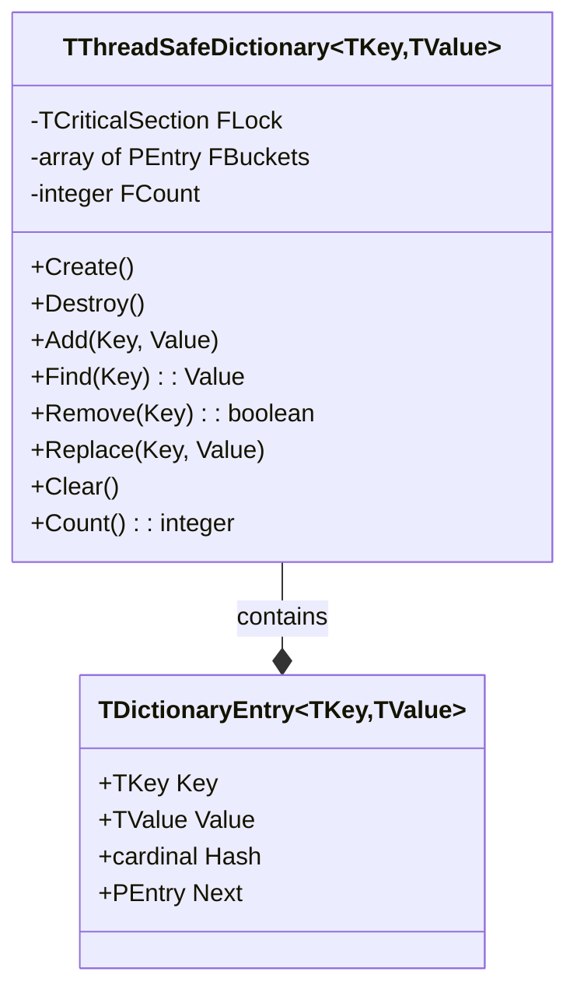

# ThreadSafeDictionary Documentation

A thread-safe, generic dictionary implementation in Free Pascal using separate chaining for collision resolution.

## Architecture Diagram



## API Reference

### Constructor/Destructor
- `Create`: Creates a new dictionary with initial bucket size of 16
- `Destroy`: Cleans up all entries and frees resources

### Core Operations
- `Add(const Key: TKey; const Value: TValue)`: Adds new key-value pair
- `Find(const Key: TKey): TValue`: Retrieves value for key
- `Remove(const Key: TKey): boolean`: Removes entry with given key
- `Replace(const Key: TKey; const Value: TValue)`: Updates value for existing key
- `TryGetValue(const Key: TKey; out Value: TValue): boolean`: Safe value retrieval

### Navigation
- `First(out Key: TKey; out Value: TValue): boolean`: Gets first entry
- `Last(out Key: TKey; out Value: TValue): boolean`: Gets last entry

### Maintenance
- `Clear`: Removes all entries
- `Count: integer`: Returns number of items

## Technical Details

### Constants
```pascal
const
  INITIAL_BUCKET_COUNT = 16;    // Initial hash table size
  LOAD_FACTOR = 0.75;          // Resize threshold
```

### Thread Safety
- All public methods are thread-safe
- Uses `TCriticalSection` for synchronization
- Lock granularity: method-level

### Hash Table Implementation
- Separate chaining for collision resolution
- Dynamic resizing when load factor exceeds 0.75
- Bucket count always power of 2 for efficient indexing
- Hash values cached in entries for efficient resizing

### Performance Characteristics
- Average case complexity:
  - Add: O(1)
  - Find: O(1)
  - Remove: O(1)
  - Resize: O(n)
- Space complexity: O(n)

### Type Support
- String keys: Uses XXHash32
- Integer keys: Uses MultiplicativeHash
- Other types: Uses DefaultHash
- All hash values masked to positive numbers

## Usage Example

```pascal
var
  Dict: specialize TThreadSafeDictionary<string, integer>;
begin
  Dict := TThreadSafeDictionary.Create;
  try
    // Add items
    Dict.Add('one', 1);
    Dict.Add('two', 2);

    // Find item
    WriteLn(Dict.Find('one'));  // Outputs: 1

    // Try get value
    var Value: integer;
    if Dict.TryGetValue('two', Value) then
      WriteLn(Value);  // Outputs: 2

    // Remove item
    Dict.Remove('one');
  finally
    Dict.Free;
  end;
end;
```

## Best Practices

1. Memory Management
   - Always use try-finally blocks
   - Call Free when done
   - Clear removes all items but maintains buckets

2. Thread Safety
   - All operations are internally synchronized
   - No need for external locking
   - Keep operations atomic for best performance

3. Performance Optimization
   - Initialize with expected size if known
   - Use TryGetValue instead of Find when appropriate
   - Consider key distribution for hash efficiency

## Known Limitations

1. No iterator support
2. First/Last operations are not order-preserving
3. No bulk operations
4. No concurrent iteration support

## Debugging

Set `DEBUG_LOGGING := True` for detailed operation logging:
```pascal
const
  DEBUG_LOGGING = True;  // Enable debug output
```

## Version History

- 0.1.0: Initial implementation
  - Basic thread-safe operations
  - Separate chaining
  - Dynamic resizing