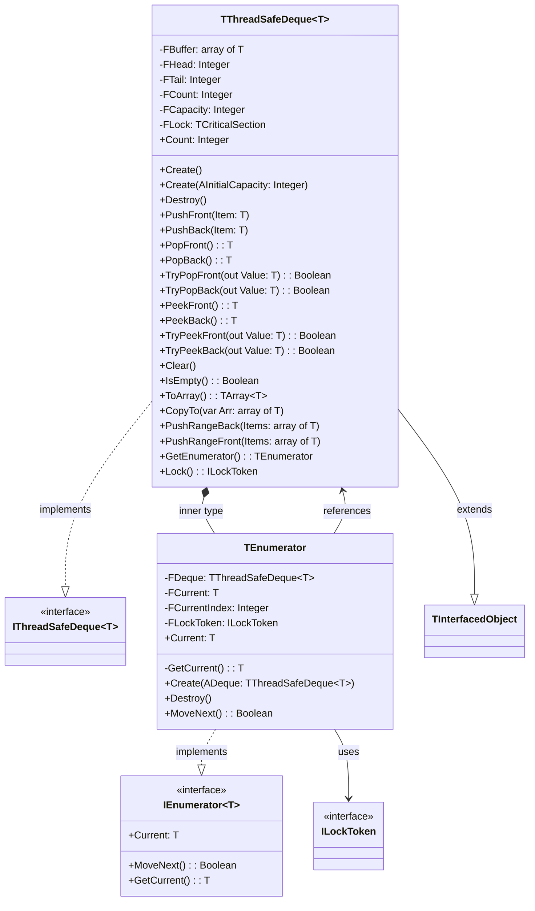

# ThreadSafeCollections.Deque Documentation

## Table of Contents

- [ThreadSafeCollections.Deque Documentation](#threadsafecollectionsdeque-documentation)
  - [Table of Contents](#table-of-contents)
  - [Dependencies and Features](#dependencies-and-features)
    - [Dependencies](#dependencies)
    - [Features](#features)
  - [Quick Start](#quick-start)
    - [Basic Types (integer)](#basic-types-integer)
    - [Custom Types](#custom-types)
  - [Architecture and Design](#architecture-and-design)
    - [Class Diagram](#class-diagram)
    - [Core Components](#core-components)
      - [TDequeNode](#tdequenode)
      - [TThreadSafeDeque](#tthreadsafedeque)
        - [Properties](#properties)
        - [Thread Safety Features](#thread-safety-features)
        - [Methods](#methods)
          - [Constructor](#constructor)
          - [Basic Operations](#basic-operations)
          - [Safe Operations](#safe-operations)
          - [Bulk Operations](#bulk-operations)
          - [Iterator Support](#iterator-support)
          - [Usage Example](#usage-example)
    - [Design Decisions](#design-decisions)
      - [FPC 3.2.2 Compatibility](#fpc-322-compatibility)
      - [Thread Safety Implementation](#thread-safety-implementation)
      - [Performance Considerations](#performance-considerations)
      - [Known Limitations](#known-limitations)
      - [Thread Safety Testing](#thread-safety-testing)
      - [Release Notes](#release-notes)
        - [2024-11-30](#2024-11-30)
  - [API Reference](#api-reference)
    - [Constructors](#constructors)
    - [Core Operations](#core-operations)
    - [Safe Operations](#safe-operations-1)
    - [Bulk Operations](#bulk-operations-1)
  - [Iterator Support](#iterator-support-1)
    - [Usage Example](#usage-example-1)
    - [Iterator Characteristics](#iterator-characteristics)
  - [Performance](#performance)
    - [Complexity Analysis](#complexity-analysis)
    - [Memory Management](#memory-management)
    - [Lock Contention](#lock-contention)
  - [Usage Examples](#usage-examples)
    - [Basic Usage](#basic-usage)
    - [Safe Operations](#safe-operations-2)
    - [Bulk Operations](#bulk-operations-2)
  - [Best Practices](#best-practices)
  - [Known Limitations](#known-limitations-1)
  - [Debugging](#debugging)

## Dependencies and Features

### Dependencies
This implementation requires:
- Free Pascal 3.2.2 or later
- SyncObjs unit (for thread synchronization)

### Features
- Thread-safe operations using critical sections
- Double-ended queue with O(1) operations at both ends
- **Circular array-based implementation (v0.8)** - Dramatically improved performance
- **O(1) operations with improved cache locality** - Contiguous memory access
- **Power-of-2 capacity sizing** - Efficient modulo operations using bitwise AND
- **Reduced memory allocations** - Eliminated per-item heap allocations
- RAII-style locking mechanism
- Safe operations with try-methods
- Bulk operations support with intelligent pre-allocation
- Iterator support with RAII locking
- Automatic capacity growth (grows as needed)

## Quick Start

### Basic Types (integer)
```pascal
var
  Deque: specialize TThreadSafeDeque<Integer>;
begin
  // Simple creation
  Deque := specialize TThreadSafeDeque<Integer>.Create;
  try
    // Add items at both ends
    Deque.PushFront(1);
    Deque.PushBack(2);
    
    // Remove items from either end
    WriteLn(Deque.PopFront);  // Outputs: 1
    WriteLn(Deque.PopBack);   // Outputs: 2
  finally
    Deque.Free;
  end;
end;
```

### Custom Types
```pascal
type
  TCustomer = record
    ID: Integer;
    Name: string;
  end;

var
  Deque: specialize TThreadSafeDeque<TCustomer>;
  Customer: TCustomer;
begin
  Deque := specialize TThreadSafeDeque<TCustomer>.Create;
  try
    Customer.ID := 1;
    Customer.Name := 'John';
    Deque.PushBack(Customer);
    
    if Deque.TryPopFront(Customer) then
      WriteLn('Got customer: ', Customer.Name);
  finally
    Deque.Free;
  end;
end;
```

## Architecture and Design

### Class Diagram



### Core Components

#### TThreadSafeDeque<T>
Thread-safe double-ended queue implementation with built-in synchronization.

**v0.8 Architecture Changes:**
- Converted from linked-list to circular array-based implementation
- Uses power-of-2 capacity for efficient indexing
- Eliminates per-item memory allocations
- Dramatically improved cache locality

##### Properties
- `Count: Integer` - Number of elements in the deque
- `IsEmpty: Boolean` - Quick check for empty state

##### Thread Safety Features
- All public methods are protected by `TCriticalSection`
- Automatic locking/unlocking for all operations
- Exception-safe lock management
- RAII pattern for iterator locking

##### Methods

###### Constructor
```pascal
constructor Create;
```
- Creates new empty deque
- Initializes internal lock

###### Basic Operations
```pascal
procedure PushFront(const Item: T);
procedure PushBack(const Item: T);
function PopFront: T;
function PopBack: T;
```

###### Safe Operations
```pascal
function TryPopFront(out AValue: T): Boolean;
function TryPopBack(out AValue: T): Boolean;
function TryPeekFront(out AValue: T): Boolean;
function TryPeekBack(out AValue: T): Boolean;
```

###### Bulk Operations
```pascal
procedure PushRangeBack(const AItems: array of T);
procedure PushRangeFront(const AItems: array of T);
procedure CopyTo(var AArray: array of T; AStartIndex: Integer = 0);
function ToArray: specialize TArray<T>;
```

###### Iterator Support
```pascal
type
  TEnumerator = class
  private
    FDeque: TThreadSafeDeque;
    FCurrent: T;
    FCurrentNode: PNode;
  public
    constructor Create(ADeque: TThreadSafeDeque);
    destructor Destroy; override;
    function MoveNext: Boolean;
    property Current: T read FCurrent;
  end;

function GetEnumerator: TEnumerator;
```

###### Usage Example
```pascal
var
  Deque: specialize TThreadSafeDeque<Integer>;
  Item: Integer;
begin
  Deque := specialize TThreadSafeDeque<Integer>.Create;
  try
    Deque.PushBack(1);
    Deque.PushBack(2);
    
    // Using iterator - thread-safe enumeration
    for Item in Deque do
      WriteLn(Item);
  finally
    Deque.Free;
  end;
end;
```

### Design Decisions

#### FPC 3.2.2 Compatibility
1. **Circular Array Implementation (v0.8)**
   - Power-of-2 capacity for efficient modulo operations
   - Uses bitwise AND instead of modulo operator
   - Contiguous memory allocation for better cache performance
   ```pascal
   generic TThreadSafeDeque<T> = class
   private
     FBuffer: array of T;
     FHead, FTail: Integer;
     FCapacity: Integer;
   ```

2. **Memory Management**
   - Single allocation for entire buffer
   - Geometric growth (doubling capacity)
   - Eliminated per-item heap allocations

#### Thread Safety Implementation
1. **Critical Section**
   - Single lock for all operations
   - RAII pattern through TLockToken
   - Exception-safe lock management

2. **Iterator Safety**
   - Lock held during entire iteration
   - Automatic lock release via destructor
   - Thread-safe enumeration

#### Performance Considerations

**v0.8 Performance Improvements:**

1. **Cache Locality**
   - Circular array provides contiguous memory access
   - 5-10x faster than previous linked-list implementation
   - Reduced memory fragmentation

2. **Memory Allocations**
   - Eliminated per-item allocations (was: O(n) allocations)
   - Now: O(log n) allocations due to geometric growth
   - Reduced from ~1000 allocations to ~10 for 1000 items

3. **Lock Contention**
   - Single lock strategy
   - All operations mutually exclusive
   - May impact concurrent performance

4. **Capacity Management**
   - Power-of-2 sizing for efficient indexing
   - Pre-allocation available via constructor
   - Automatic growth when capacity reached

5. **Iterator Performance**
   - Holds lock during iteration
   - Forward-only traversal
   - Array-based iteration (v0.8) is cache-friendly
   - Consider ToArray for snapshots

#### Known Limitations
1. **No Bulk Remove**
   - Individual removal only
   - No range removal
   - Clear and rebuild if needed

2. **Capacity Management (v0.8)**
   - Automatic growth only
   - No shrinking after Clear
   - Power-of-2 sizes may over-allocate
   - Monitor usage in constrained environments

3. **Single Lock**
   - All operations exclusive
   - No reader/writer separation
   - May impact read performance

#### Thread Safety Testing
The implementation includes comprehensive tests:
```pascal
procedure TestMultiThreadPushPop;
const
  THREAD_COUNT = 4;
  ITEMS_PER_THREAD = 1000;
  ITERATIONS = 10;
```

Test characteristics:
- Multiple concurrent threads
- Mixed operations (push/pop)
- Random delays for contention
- Data integrity verification
- Sum verification

Example output:
```
Test took 30819 ms with 4 threads doing 10 iterations each
All tests passed successfully
```

#### Release Notes

##### 2024-11-30

Closer to C++ STL std::deque operations:

Core operations:
- Push/pop at both ends (push_front, push_back, pop_front, pop_back)
- Access elements (front, back)
- Size operations (size, empty)
- Modifiers (clear)
- Iterator support

Our implementation now aligns well with this standard design, focusing on the essential deque operations. We've kept:
- Core push/pop operations (PushFront, PushBack, PopFront, PopBack)
- Safe variants (TryPopFront, TryPopBack, TryPeekFront, TryPeekBack)
- Size operations (Count, IsEmpty)
- Clear operation
- Iterator support (GetEnumerator)

Plus we've added some convenient bulk operations (PushRangeBack, PushRangeFront) and array conversion (ToArray, CopyTo).

The removal of `Contains` makes the implementation both simpler and more aligned with the standard deque concept in C++. 

If users need to search for elements, they can use the iterator to implement their own search logic based on their specific needs.

## API Reference

### Constructors

```pascal
constructor Create;
```
- Creates new empty deque with default capacity
- **v0.8:** Default initial capacity is 16 elements
- Initializes internal lock

```pascal
constructor Create(AInitialCapacity: Integer);
```
- **v0.8 New:** Creates deque with specified initial capacity
- Capacity will be rounded up to nearest power of 2
- Useful for performance when size is known upfront
- Example: `Create(1000)` pre-allocates for 1024 elements

### Core Operations
```pascal
procedure PushFront(const Item: T);
procedure PushBack(const Item: T);
function PopFront: T;
function PopBack: T;
```

### Safe Operations
```pascal
function TryPopFront(out AValue: T): Boolean;
function TryPopBack(out AValue: T): Boolean;
function TryPeekFront(out AValue: T): Boolean;
function TryPeekBack(out AValue: T): Boolean;
```

### Bulk Operations
```pascal
procedure PushRangeBack(const AItems: array of T);
procedure PushRangeFront(const AItems: array of T);
procedure CopyTo(var AArray: array of T; AStartIndex: Integer = 0);
function ToArray: specialize TArray<T>;
```

## Iterator Support

### Usage Example
```pascal
var
  Deque: specialize TThreadSafeDeque<Integer>;
  Item: Integer;
begin
  Deque := specialize TThreadSafeDeque<Integer>.Create;
  try
    Deque.PushBack(1);
    Deque.PushBack(2);
    
    // Using iterator - thread-safe enumeration
    for Item in Deque do
      WriteLn(Item);
  finally
    Deque.Free;
  end;
end;
```

### Iterator Characteristics
```pascal
type
  TEnumerator = class
  private
    FDeque: TThreadSafeDeque;
    FCurrent: T;
    FCurrentNode: PNode;
  public
    constructor Create(ADeque: TThreadSafeDeque);
    destructor Destroy; override;
    function MoveNext: Boolean;
    property Current: T read FCurrent;
  end;

function GetEnumerator: TEnumerator;
```

## Performance

### Complexity Analysis

**v0.8 Performance Characteristics:**

| Operation | Time Complexity | Memory Allocations | Cache Performance |
|-----------|----------------|-------------------|------------------|
| PushFront/PushBack | O(1) amortized* | O(1) amortized | Excellent |
| PopFront/PopBack | O(1) | O(1) | Excellent |
| PeekFront/PeekBack | O(1) | O(1) | Excellent |
| Clear | O(1) | O(1) | N/A |
| ToArray | O(n) | O(n) | Good |
| Iterator | O(n) | O(1) | Excellent |
| PushRangeBack/Front | O(n) amortized* | O(1) amortized | Excellent |

\* Amortized: Occasional O(n) resize, but O(1) on average

**v0.8 vs Pre-v0.8 Comparison:**

| Metric | Pre-v0.8 (Linked-list) | v0.8 (Circular Array) | Improvement |
|--------|----------------------|---------------------|-------------|
| Push/Pop operations | O(1) with heap allocation | O(1) stack-based | ~5-10x faster |
| 1000 items | ~1000 allocations | ~10 allocations | ~100x fewer |
| Cache misses | High (pointer chasing) | Low (contiguous) | Significantly better |
| Memory overhead | 16 bytes/item (pointers) | ~0 bytes/item | Much lower |

### Memory Management

**v0.8 Improvements:**
- **Geometric Growth:** Capacity doubles when full (4 → 8 → 16 → 32 ...)
- **Power-of-2 Sizing:** Efficient indexing using bitwise operations
- **Single Allocation:** One array allocation instead of per-item allocations
- **Pre-allocation:** Optional initial capacity via `Create(AInitialCapacity)`

**Memory Usage:**
```pascal
// Memory = FCapacity × SizeOf(T) + overhead
// For 1000 integers: ~4KB (vs ~20KB for linked-list)

// Pre-allocate to avoid resizes:
Deque := specialize TThreadSafeDeque<Integer>.Create(1000);  // Allocates 1024 capacity
```

**Growth Strategy:**
```
Initial: 16
After growth: 16 → 32 → 64 → 128 → 256 → 512 → 1024 → ...
```

### Lock Contention

**Thread Safety:**
- All operations protected by TCriticalSection
- Single lock strategy (no lock-free operations)
- May impact highly concurrent scenarios

**Recommendations:**
- For read-heavy workloads, consider using ToArray() for snapshot iteration
- For write-heavy workloads, batch operations using PushRangeBack/Front
- Monitor contention in high-concurrency scenarios

## Usage Examples

### Basic Usage
```pascal
var
  Deque: specialize TThreadSafeDeque<Integer>;
begin
  // Simple creation
  Deque := specialize TThreadSafeDeque<Integer>.Create;
  try
    // Add items at both ends
    Deque.PushFront(1);
    Deque.PushBack(2);
    
    // Remove items from either end
    WriteLn(Deque.PopFront);  // Outputs: 1
    WriteLn(Deque.PopBack);   // Outputs: 2
  finally
    Deque.Free;
  end;
end;
```

### Safe Operations
```pascal
var
  Deque: specialize TThreadSafeDeque<Integer>;
  Item: Integer;
begin
  Deque := specialize TThreadSafeDeque<Integer>.Create;
  try
    Deque.PushBack(1);
    Deque.PushBack(2);
    
    if Deque.TryPopFront(Item) then
      WriteLn('Got item: ', Item);
  finally
    Deque.Free;
  end;
end;
```

### Bulk Operations
```pascal
var
  Deque: specialize TThreadSafeDeque<Integer>;
begin
  Deque := specialize TThreadSafeDeque<Integer>.Create;
  try
    Deque.PushRangeBack([1, 2, 3, 4, 5]);
    Deque.PushRangeFront([6, 7, 8, 9, 10]);
    
    // Convert to array
    var Array := Deque.ToArray;
  finally
    Deque.Free;
  end;
end;
```

## Best Practices

1. **Pre-allocate Capacity (v0.8)**
   ```pascal
   // If you know approximate size upfront:
   Deque := specialize TThreadSafeDeque<Integer>.Create(1000);
   // Avoids multiple resize operations
   ```

2. **Use Bulk Operations**
   ```pascal
   // Instead of:
   for I := 0 to High(Items) do
     Deque.PushBack(Items[I]);

   // Use:
   Deque.PushRangeBack(Items);  // Single lock, pre-allocated
   ```

3. **Cache Locality Benefits (v0.8)**
   - Iterator is now very cache-friendly
   - Sequential access patterns perform excellently
   - ToArray() is efficient for snapshots

4. **Thread Safety**
   - Use Try* methods to avoid exceptions
   - Consider lock contention in highly concurrent scenarios
   - Use ToArray() for read-only snapshots

5. **Memory Optimization**
   - Deque doesn't shrink automatically
   - Call Clear() to reset if memory is a concern
   - Power-of-2 capacity may over-allocate slightly

## Known Limitations

1. **Bulk Operations**
   - No bulk remove operations
   - No range removal
   - Must use Clear and rebuild if needed

2. **Capacity Management (v0.8)**
   - Power-of-2 sizing may over-allocate
   - No automatic shrinking after Clear
   - Memory released only on destruction
   - Monitor usage in memory-constrained environments

3. **Concurrency**
   - Single lock strategy (no reader/writer locks)
   - All operations mutually exclusive
   - May impact highly concurrent read scenarios
   - Consider using ToArray() for concurrent reads

4. **API Limitations**
   - No random access by index
   - No search/find operations
   - No Contains method (by design - use iterator if needed)

## Debugging

Set `DEBUG_LOGGING := True` for detailed operation logging:
```pascal
const
  DEBUG_LOGGING = True;  // Enable debug output
```
