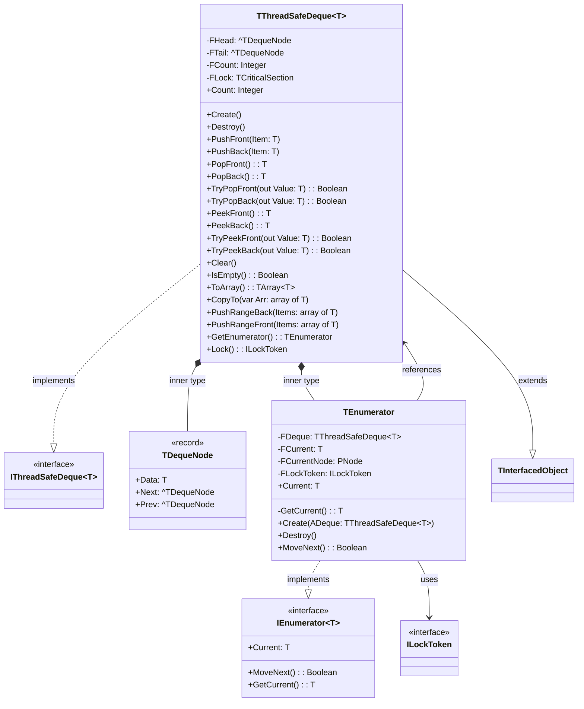

# ThreadSafeCollections.Deque Documentation

## Table of Contents

- [ThreadSafeCollections.Deque Documentation](#threadsafecollectionsdeque-documentation)
  - [Table of Contents](#table-of-contents)
  - [Dependencies and Features](#dependencies-and-features)
    - [Dependencies](#dependencies)
    - [Features](#features)
  - [Quick Start](#quick-start)
    - [Basic Types (integer)](#basic-types-integer)
    - [Custom Types](#custom-types)
  - [Architecture and Design](#architecture-and-design)
    - [Class Diagram](#class-diagram)
    - [Core Components](#core-components)
      - [TDequeNode](#tdequenode)
      - [TThreadSafeDeque](#tthreadsafedeque)
        - [Properties](#properties)
        - [Thread Safety Features](#thread-safety-features)
        - [Methods](#methods)
          - [Constructor](#constructor)
          - [Basic Operations](#basic-operations)
          - [Safe Operations](#safe-operations)
          - [Bulk Operations](#bulk-operations)
          - [Iterator Support](#iterator-support)
          - [Usage Example](#usage-example)
    - [Design Decisions](#design-decisions)
      - [FPC 3.2.2 Compatibility](#fpc-322-compatibility)
      - [Thread Safety Implementation](#thread-safety-implementation)
      - [Performance Considerations](#performance-considerations)
      - [Known Limitations](#known-limitations)
      - [Thread Safety Testing](#thread-safety-testing)
      - [Release Notes](#release-notes)
        - [2024-11-30](#2024-11-30)
  - [API Reference](#api-reference)
    - [Constructors](#constructors)
    - [Core Operations](#core-operations)
    - [Safe Operations](#safe-operations-1)
    - [Bulk Operations](#bulk-operations-1)
  - [Iterator Support](#iterator-support-1)
    - [Usage Example](#usage-example-1)
    - [Iterator Characteristics](#iterator-characteristics)
  - [Performance](#performance)
    - [Complexity Analysis](#complexity-analysis)
    - [Memory Management](#memory-management)
    - [Lock Contention](#lock-contention)
  - [Usage Examples](#usage-examples)
    - [Basic Usage](#basic-usage)
    - [Safe Operations](#safe-operations-2)
    - [Bulk Operations](#bulk-operations-2)
  - [Best Practices](#best-practices)
  - [Known Limitations](#known-limitations-1)
  - [Debugging](#debugging)

## Dependencies and Features

### Dependencies
This implementation requires:
- Free Pascal 3.2.2 or later
- SyncObjs unit (for thread synchronization)

### Features
- Thread-safe operations using critical sections
- Double-ended queue with O(1) operations at both ends
- RAII-style locking mechanism
- Safe operations with try-methods
- Bulk operations support
- Iterator support with RAII locking
- No capacity limitations (grows as needed)
- Memory efficient node-based implementation

## Quick Start

### Basic Types (integer)
```pascal
var
  Deque: specialize TThreadSafeDeque<Integer>;
begin
  // Simple creation
  Deque := specialize TThreadSafeDeque<Integer>.Create;
  try
    // Add items at both ends
    Deque.PushFront(1);
    Deque.PushBack(2);
    
    // Remove items from either end
    WriteLn(Deque.PopFront);  // Outputs: 1
    WriteLn(Deque.PopBack);   // Outputs: 2
  finally
    Deque.Free;
  end;
end;
```

### Custom Types
```pascal
type
  TCustomer = record
    ID: Integer;
    Name: string;
  end;

var
  Deque: specialize TThreadSafeDeque<TCustomer>;
  Customer: TCustomer;
begin
  Deque := specialize TThreadSafeDeque<TCustomer>.Create;
  try
    Customer.ID := 1;
    Customer.Name := 'John';
    Deque.PushBack(Customer);
    
    if Deque.TryPopFront(Customer) then
      WriteLn('Got customer: ', Customer.Name);
  finally
    Deque.Free;
  end;
end;
```

## Architecture and Design

### Class Diagram



### Core Components

#### TDequeNode<T>
Internal node structure for the deque:
- Data: Generic type T
- Next: Pointer to next node
- Prev: Pointer to previous node
- Used for doubly-linked list implementation

#### TThreadSafeDeque<T>
Thread-safe double-ended queue implementation with built-in synchronization.

##### Properties
- `Count: Integer` - Number of elements in the deque
- `IsEmpty: Boolean` - Quick check for empty state

##### Thread Safety Features
- All public methods are protected by `TCriticalSection`
- Automatic locking/unlocking for all operations
- Exception-safe lock management
- RAII pattern for iterator locking

##### Methods

###### Constructor
```pascal
constructor Create;
```
- Creates new empty deque
- Initializes internal lock

###### Basic Operations
```pascal
procedure PushFront(const Item: T);
procedure PushBack(const Item: T);
function PopFront: T;
function PopBack: T;
```

###### Safe Operations
```pascal
function TryPopFront(out AValue: T): Boolean;
function TryPopBack(out AValue: T): Boolean;
function TryPeekFront(out AValue: T): Boolean;
function TryPeekBack(out AValue: T): Boolean;
```

###### Bulk Operations
```pascal
procedure PushRangeBack(const AItems: array of T);
procedure PushRangeFront(const AItems: array of T);
procedure CopyTo(var AArray: array of T; AStartIndex: Integer = 0);
function ToArray: specialize TArray<T>;
```

###### Iterator Support
```pascal
type
  TEnumerator = class
  private
    FDeque: TThreadSafeDeque;
    FCurrent: T;
    FCurrentNode: PNode;
  public
    constructor Create(ADeque: TThreadSafeDeque);
    destructor Destroy; override;
    function MoveNext: Boolean;
    property Current: T read FCurrent;
  end;

function GetEnumerator: TEnumerator;
```

###### Usage Example
```pascal
var
  Deque: specialize TThreadSafeDeque<Integer>;
  Item: Integer;
begin
  Deque := specialize TThreadSafeDeque<Integer>.Create;
  try
    Deque.PushBack(1);
    Deque.PushBack(2);
    
    // Using iterator - thread-safe enumeration
    for Item in Deque do
      WriteLn(Item);
  finally
    Deque.Free;
  end;
end;
```

### Design Decisions

#### FPC 3.2.2 Compatibility
1. **Generic Type Forward Declarations**
   - FPC 3.2.2 limitation: No support for generic type forward declarations
   - Solution: Nested type declarations within main class
   ```pascal
   generic TThreadSafeDeque<T> = class
   private
     type
       TDequeNode = record
         Data: T;
         Next, Prev: ^TDequeNode;
       end;
   ```

2. **Node Structure**
   - Self-contained type definitions
   - Simplified pointer declarations
   - Avoids complex generic type references

#### Thread Safety Implementation
1. **Critical Section**
   - Single lock for all operations
   - RAII pattern through TLockToken
   - Exception-safe lock management

2. **Iterator Safety**
   - Lock held during entire iteration
   - Automatic lock release via destructor
   - Thread-safe enumeration

#### Performance Considerations
1. **Lock Contention**
   - Single lock strategy
   - All operations mutually exclusive
   - May impact concurrent performance

2. **Memory Management**
   - Dynamic node allocation
   - No pre-allocation
   - Node cleanup in Clear/Destroy

3. **Iterator Performance**
   - Holds lock during iteration
   - Forward-only traversal
   - Consider ToArray for snapshots

#### Known Limitations
1. **No Bulk Remove**
   - Individual removal only
   - No range removal
   - Clear and rebuild if needed

2. **No Capacity Control**
   - Unlimited growth
   - No memory limits
   - Monitor usage in constrained environments

3. **Single Lock**
   - All operations exclusive
   - No reader/writer separation
   - May impact read performance

#### Thread Safety Testing
The implementation includes comprehensive tests:
```pascal
procedure TestMultiThreadPushPop;
const
  THREAD_COUNT = 4;
  ITEMS_PER_THREAD = 1000;
  ITERATIONS = 10;
```

Test characteristics:
- Multiple concurrent threads
- Mixed operations (push/pop)
- Random delays for contention
- Data integrity verification
- Sum verification

Example output:
```
Test took 30819 ms with 4 threads doing 10 iterations each
All tests passed successfully
```

#### Release Notes

##### 2024-11-30

Closer to C++ STL std::deque operations:

Core operations:
- Push/pop at both ends (push_front, push_back, pop_front, pop_back)
- Access elements (front, back)
- Size operations (size, empty)
- Modifiers (clear)
- Iterator support

Our implementation now aligns well with this standard design, focusing on the essential deque operations. We've kept:
- Core push/pop operations (PushFront, PushBack, PopFront, PopBack)
- Safe variants (TryPopFront, TryPopBack, TryPeekFront, TryPeekBack)
- Size operations (Count, IsEmpty)
- Clear operation
- Iterator support (GetEnumerator)

Plus we've added some convenient bulk operations (PushRangeBack, PushRangeFront) and array conversion (ToArray, CopyTo).

The removal of `Contains` makes the implementation both simpler and more aligned with the standard deque concept in C++. 

If users need to search for elements, they can use the iterator to implement their own search logic based on their specific needs.

## API Reference

### Constructors
```pascal
constructor Create;
```
- Creates new empty deque
- Initializes internal lock

### Core Operations
```pascal
procedure PushFront(const Item: T);
procedure PushBack(const Item: T);
function PopFront: T;
function PopBack: T;
```

### Safe Operations
```pascal
function TryPopFront(out AValue: T): Boolean;
function TryPopBack(out AValue: T): Boolean;
function TryPeekFront(out AValue: T): Boolean;
function TryPeekBack(out AValue: T): Boolean;
```

### Bulk Operations
```pascal
procedure PushRangeBack(const AItems: array of T);
procedure PushRangeFront(const AItems: array of T);
procedure CopyTo(var AArray: array of T; AStartIndex: Integer = 0);
function ToArray: specialize TArray<T>;
```

## Iterator Support

### Usage Example
```pascal
var
  Deque: specialize TThreadSafeDeque<Integer>;
  Item: Integer;
begin
  Deque := specialize TThreadSafeDeque<Integer>.Create;
  try
    Deque.PushBack(1);
    Deque.PushBack(2);
    
    // Using iterator - thread-safe enumeration
    for Item in Deque do
      WriteLn(Item);
  finally
    Deque.Free;
  end;
end;
```

### Iterator Characteristics
```pascal
type
  TEnumerator = class
  private
    FDeque: TThreadSafeDeque;
    FCurrent: T;
    FCurrentNode: PNode;
  public
    constructor Create(ADeque: TThreadSafeDeque);
    destructor Destroy; override;
    function MoveNext: Boolean;
    property Current: T read FCurrent;
  end;

function GetEnumerator: TEnumerator;
```

## Performance

### Complexity Analysis
```pascal
procedure TestMultiThreadPushPop;
const
  THREAD_COUNT = 4;
  ITEMS_PER_THREAD = 1000;
  ITERATIONS = 10;
```

### Memory Management
```pascal
procedure TestMultiThreadPushPop;
const
  THREAD_COUNT = 4;
  ITEMS_PER_THREAD = 1000;
  ITERATIONS = 10;
```

### Lock Contention
```pascal
procedure TestMultiThreadPushPop;
const
  THREAD_COUNT = 4;
  ITEMS_PER_THREAD = 1000;
  ITERATIONS = 10;
```

## Usage Examples

### Basic Usage
```pascal
var
  Deque: specialize TThreadSafeDeque<Integer>;
begin
  // Simple creation
  Deque := specialize TThreadSafeDeque<Integer>.Create;
  try
    // Add items at both ends
    Deque.PushFront(1);
    Deque.PushBack(2);
    
    // Remove items from either end
    WriteLn(Deque.PopFront);  // Outputs: 1
    WriteLn(Deque.PopBack);   // Outputs: 2
  finally
    Deque.Free;
  end;
end;
```

### Safe Operations
```pascal
var
  Deque: specialize TThreadSafeDeque<Integer>;
  Item: Integer;
begin
  Deque := specialize TThreadSafeDeque<Integer>.Create;
  try
    Deque.PushBack(1);
    Deque.PushBack(2);
    
    if Deque.TryPopFront(Item) then
      WriteLn('Got item: ', Item);
  finally
    Deque.Free;
  end;
end;
```

### Bulk Operations
```pascal
var
  Deque: specialize TThreadSafeDeque<Integer>;
begin
  Deque := specialize TThreadSafeDeque<Integer>.Create;
  try
    Deque.PushRangeBack([1, 2, 3, 4, 5]);
    Deque.PushRangeFront([6, 7, 8, 9, 10]);
    
    // Convert to array
    var Array := Deque.ToArray;
  finally
    Deque.Free;
  end;
end;
```

## Best Practices
- Use thread-safe collections for concurrent access scenarios
- Avoid unnecessary locking
- Consider the performance implications of lock contention

## Known Limitations
- No bulk remove operations
- No range removal
- Clear and rebuild if needed
- No capacity control
- Unlimited growth
- Monitor usage in constrained environments
- Single lock strategy
- No reader/writer separation
- May impact read performance

## Debugging

Set `DEBUG_LOGGING := True` for detailed operation logging:
```pascal
const
  DEBUG_LOGGING = True;  // Enable debug output
```
