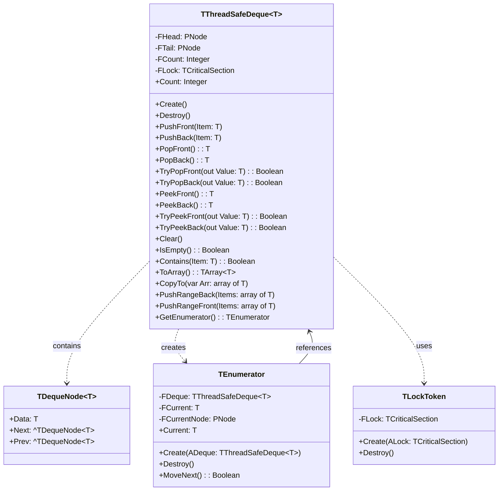

# ThreadSafeCollections.Deque API Documentation

## Component Diagram



## Core Components

### TDequeNode<T>
Internal node structure for the deque:
- Data: Generic type T
- Next: Pointer to next node
- Prev: Pointer to previous node
- Used for doubly-linked list implementation

### TThreadSafeDeque<T>
Thread-safe double-ended queue implementation with built-in synchronization.

#### Properties
- `Count: Integer` - Number of elements in the deque
- `IsEmpty: Boolean` - Quick check for empty state

#### Thread Safety Features
- All public methods are protected by `TCriticalSection`
- Automatic locking/unlocking for all operations
- Exception-safe lock management
- RAII pattern for iterator locking

#### Methods

##### Constructor
```pascal
constructor Create;
```
- Creates new empty deque
- Initializes internal lock

##### Basic Operations
```pascal
procedure PushFront(const Item: T);
procedure PushBack(const Item: T);
function PopFront: T;
function PopBack: T;
```

##### Safe Operations
```pascal
function TryPopFront(out AValue: T): Boolean;
function TryPopBack(out AValue: T): Boolean;
function TryPeekFront(out AValue: T): Boolean;
function TryPeekBack(out AValue: T): Boolean;
```

##### Bulk Operations
```pascal
procedure PushRangeBack(const AItems: array of T);
procedure PushRangeFront(const AItems: array of T);
procedure CopyTo(var AArray: array of T; AStartIndex: Integer = 0);
function ToArray: specialize TArray<T>;
```

### Iterator Support
```pascal
type
  TEnumerator = class
  private
    FDeque: TThreadSafeDeque;
    FCurrent: T;
    FCurrentNode: PNode;
  public
    constructor Create(ADeque: TThreadSafeDeque);
    destructor Destroy; override;
    function MoveNext: Boolean;
    property Current: T read FCurrent;
  end;

function GetEnumerator: TEnumerator;
```

#### Usage Example
```pascal
var
  Deque: specialize TThreadSafeDeque<Integer>;
  Item: Integer;
begin
  Deque := specialize TThreadSafeDeque<Integer>.Create;
  try
    Deque.PushBack(1);
    Deque.PushBack(2);
    
    // Using iterator
    for Item in Deque do
      WriteLn(Item);
  finally
    Deque.Free;
  end;
end;
```

## Design Decisions

### FPC 3.2.2 Compatibility
1. **Generic Type Forward Declarations**
   - FPC 3.2.2 limitation: No support for generic type forward declarations
   - Solution: Nested type declarations within main class
   ```pascal
   generic TThreadSafeDeque<T> = class
   private
     type
       TDequeNode = record
         Data: T;
         Next, Prev: ^TDequeNode;
       end;
   ```

2. **Node Structure**
   - Self-contained type definitions
   - Simplified pointer declarations
   - Avoids complex generic type references

### Thread Safety Implementation
1. **Critical Section**
   - Single lock for all operations
   - RAII pattern through TLockToken
   - Exception-safe lock management

2. **Iterator Safety**
   - Lock held during entire iteration
   - Automatic lock release via destructor
   - Thread-safe enumeration

## Performance Considerations

1. **Lock Contention**
   - Single lock strategy
   - All operations mutually exclusive
   - May impact concurrent performance

2. **Memory Management**
   - Dynamic node allocation
   - No pre-allocation
   - Node cleanup in Clear/Destroy

3. **Iterator Performance**
   - Holds lock during iteration
   - Forward-only traversal
   - Consider ToArray for snapshots

## Known Limitations

1. **No Bulk Remove**
   - Individual removal only
   - No range removal
   - Clear and rebuild if needed

2. **No Capacity Control**
   - Unlimited growth
   - No memory limits
   - Monitor usage in constrained environments

3. **Single Lock**
   - All operations exclusive
   - No reader/writer separation
   - May impact read performance

## Thread Safety Testing

The implementation includes comprehensive tests:
```pascal
procedure TestMultiThreadPushPop;
const
  THREAD_COUNT = 4;
  ITEMS_PER_THREAD = 1000;
  ITERATIONS = 10;
```

Test characteristics:
- Multiple concurrent threads
- Mixed operations (push/pop)
- Random delays for contention
- Data integrity verification
- Sum verification

Example output:
```
Test took 30819 ms with 4 threads doing 10 iterations each
All tests passed successfully
```
