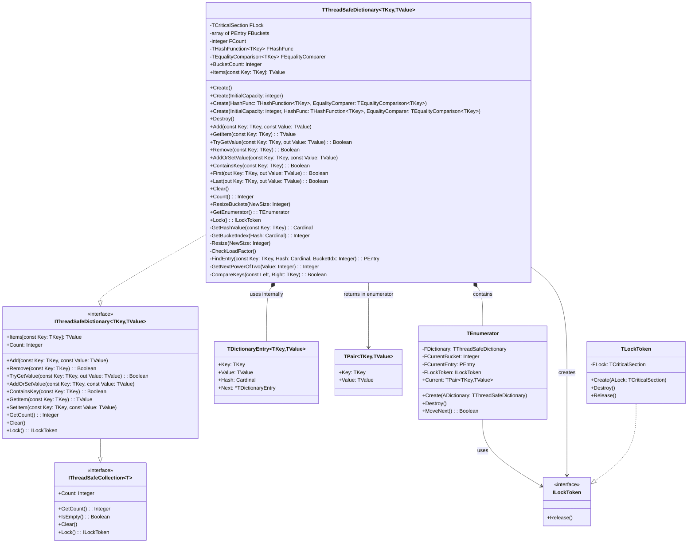

# ThreadSafeDictionary Documentation

## Table of Contents

- [ThreadSafeDictionary Documentation](#threadsafedictionary-documentation)
  - [Table of Contents](#table-of-contents)
  - [Dependencies and Features](#dependencies-and-features)
    - [Dependencies](#dependencies)
    - [Features](#features)
  - [Quick Start](#quick-start)
    - [Basic Types (string, integer)](#basic-types-string-integer)
    - [Custom/Compound Types](#customcompound-types)
  - [Architecture and Design](#architecture-and-design)
    - [Class Diagram](#class-diagram)
    - [Collision Resolution](#collision-resolution)
      - [Separate Chaining (What We Use)](#separate-chaining-what-we-use)
      - [Double Hashing (Alternative)](#double-hashing-alternative)
  - [API Reference](#api-reference)
    - [Constructors](#constructors)
    - [Core Operations](#core-operations)
    - [Bulk Operations](#bulk-operations)
    - [Navigation Methods](#navigation-methods)
    - [Iterator Support](#iterator-support)
      - [Usage Example](#usage-example)
      - [Iterator Characteristics](#iterator-characteristics)
    - [Maintenance Methods](#maintenance-methods)
    - [Constants](#constants)
  - [Implementation Details](#implementation-details)
    - [Built-in Hash Functions](#built-in-hash-functions)
    - [Thread Safety](#thread-safety)
    - [Load Factor and Resizing](#load-factor-and-resizing)
  - [Performance](#performance)
    - [Complexity Analysis](#complexity-analysis)
    - [Performance Characteristics](#performance-characteristics)
  - [Usage Examples](#usage-examples)
    - [Basic Usage](#basic-usage)
    - [Custom Types](#custom-types)
    - [Initial Capacity](#initial-capacity)
    - [Bulk Operations](#bulk-operations-1)
    - [Iterator Usage](#iterator-usage)
  - [Best Practices](#best-practices)
  - [Known Limitations](#known-limitations)
  - [Debugging](#debugging)


## Dependencies and Features

### Dependencies
This implementation requires:
- Free Pascal 3.2.2 or later
- Generics.Collections unit (for TPair support)
- SyncObjs unit (for thread synchronization)

### Features
- Thread-safe operations using critical sections
- Separate chaining for collision resolution
- Automatic resizing when load factor exceeds 0.75
- Support for custom hash functions and equality comparers
- Compatible with Delphi's TDictionary interface
- RAII-style locking mechanism
- Bulk operations support
- Iterator support with RAII locking

## Quick Start

### Basic Types (string, integer)
```pascal
var
  Dict: specialize TThreadSafeDictionary<string, integer>;
begin
  // Simple creation - uses built-in hash functions
  Dict := specialize TThreadSafeDictionary<string, integer>.Create;
  try
    Dict.Add('one', 1);
    Dict.Add('two', 2);
  finally
    Dict.Free;
  end;
end;
```

### Custom/Compound Types
```pascal
type
  TPersonKey = record
    FirstName: string;
    LastName: string;
  end;

// Define hash function
function HashPerson(const Key: TPersonKey): Cardinal;
begin
  Result := XXHash32(Key.FirstName + '|' + Key.LastName);
end;

// Define equality comparison
function ComparePerson(const Left, Right: TPersonKey): Boolean;
begin
  Result := (Left.FirstName = Right.FirstName) and 
            (Left.LastName = Right.LastName);
end;

var
  Dict: specialize TThreadSafeDictionary<TPersonKey, integer>;
begin
  // Create with custom hash and equality functions (both required for custom types)
  Dict := specialize TThreadSafeDictionary<TPersonKey, integer>.Create(@HashPerson, @ComparePerson);
  try
    var Person: TPersonKey;
    Person.FirstName := 'John';
    Person.LastName := 'Doe';
    Dict.Add(Person, 42);
  finally
    Dict.Free;
  end;
end;
```

## Architecture and Design

### Class Diagram



### Collision Resolution

#### Separate Chaining (What We Use)

```
┌─────────────┐
│ Bucket[0]   │──► [Key:A, Value:1] ──► [Key:E, Value:5] ──► null
├─────────────┤
│ Bucket[1]   │──► [Key:B, Value:2] ──► null
├─────────────┤
│ Bucket[2]   │──► null
├─────────────┤
│ Bucket[3]   │──► [Key:C, Value:3] ──► [Key:F, Value:6] ──► null
├─────────────┤
│ Bucket[4]   │──► [Key:D, Value:4] ──► null
└─────────────┘
```
- Each bucket is a linked list
- Multiple items can exist in same bucket
- No need to find another slot
- Memory usage grows with collisions
- Our implementation uses this approach

#### Double Hashing (Alternative)

```
┌─────────────┐
│ Bucket[0]   │  A
├─────────────┤
│ Bucket[1]   │  B
├─────────────┤
│ Bucket[2]   │  empty
├─────────────┤
│ Bucket[3]   │  C
├─────────────┤
│ Bucket[4]   │  D
└─────────────┘

When collision occurs at index i:
Next = (i + step * h2(key)) % tableSize
where h2(key) is a second hash function
```
- Uses two hash functions
- On collision, calculates new positions
- All items stored in main array
- Can lead to clustering
- More complex to implement

Key Differences:

1. **Storage Structure**
   - Separate Chaining: Uses linked lists
   - Double Hashing: Uses only the main array

2. **Collision Handling**
   - Separate Chaining: Simply adds to list
   - Double Hashing: Probes for next empty slot

3. **Memory Usage**
   - Separate Chaining: Can grow beyond array size
   - Double Hashing: Limited to array size

4. **Performance**
   - Separate Chaining: Consistent but may need list traversal
   - Double Hashing: Fast when load factor is low, degrades with more collisions

5. **Implementation Complexity**
   - Separate Chaining: Simpler to implement
   - Double Hashing: More complex, needs careful second hash function selection

6. **Load Factor Impact**
   - Separate Chaining: Can handle load factor > 1
   - Double Hashing: Must keep load factor < 1

## API Reference

### Constructors
- `Create`: Creates a new dictionary with default bucket size (16)
- `Create(InitialCapacity: integer)`: Creates dictionary with specified initial capacity (adjusted to power of 2)
- `Destroy`: Cleans up all entries and frees resources

### Core Operations
| Method | Description | Return Type | Thread-Safe |
|--------|-------------|-------------|-------------|
| `Add(const Key: TKey; const Value: TValue)` | Adds new key-value pair | void | Yes |
| `GetItem(const Key: TKey)` | Retrieves value for key (raises exception if not found) | TValue | Yes |
| `TryGetValue(const Key: TKey; out Value: TValue)` | Safe value retrieval | Boolean | Yes |
| `Remove(const Key: TKey)` | Removes entry with given key | Boolean | Yes |
| `AddOrSetValue(const Key: TKey; const Value: TValue)` | Updates value for existing key (raises exception if not found) | void | Yes |

### Bulk Operations
| Method | Description | Return Type | Thread-Safe |
|--------|-------------|-------------|-------------|
| `GetKeys` | Returns array of all keys | TKeyArray<TKey> | Yes |
| `GetValues` | Returns array of all values | TValueArray<TValue> | Yes |
| `TrimExcess` | Reduces internal capacity to match count | void | Yes |
| `TryAdd` | Adds key-value pair if key doesn't exist | Boolean | Yes |
| `AddRange(ADictionary)` | Adds all pairs from another dictionary | void | Yes |
| `AddRange(AArray)` | Adds all pairs from TPair array | void | Yes |
| `ToArray` | Converts dictionary to array of TPairs | TPairArray<TKey,TValue> | Yes |
| `ContainsValue` | Checks if value exists in dictionary | Boolean | Yes |

### Navigation Methods
| Method | Description | Return Type | Thread-Safe |
|--------|-------------|-------------|-------------|
| `First(out Key: TKey; out Value: TValue)` | Gets first entry in first non-empty bucket | Boolean | Yes |
| `Last(out Key: TKey; out Value: TValue)` | Gets first entry in last non-empty bucket | Boolean | Yes |

### Iterator Support

```pascal
type
  TPair = record
    Key: TKey;
    Value: TValue;
  end;
  
  TEnumerator = class
    private
      FDictionary: TThreadSafeDictionary;
      FCurrentBucket: Integer;
      FCurrentEntry: PEntry;
      FLockToken: ILockToken;
      function GetCurrent: TPair<TKey, TValue>;
    public
      constructor Create(ADictionary: TThreadSafeDictionary);
      destructor Destroy; override;
      function MoveNext: Boolean;
      property Current: TPair<TKey, TValue> read GetCurrent;
    end;
  
function GetEnumerator: TEnumerator;
```

#### Usage Example
```pascal
var
  Dict: specialize TThreadSafeDictionary<string, integer>;
  Pair: specialize TPair<string, integer>;
begin
  Dict := specialize TThreadSafeDictionary<string, integer>.Create;
  try
    Dict.Add('one', 1);
    Dict.Add('two', 2);
    
    // Using iterator
    for Pair in Dict do
      WriteLn(Format('%s: %d', [Pair.Key, Pair.Value]));
  finally
    Dict.Free;
  end;
end;
```

#### Iterator Characteristics
- Returns key-value pairs during iteration
- Thread-safe through RAII locking
- Automatic lock acquisition and release
- Exception-safe lock management
- Forward-only iteration
- Protected from modifications during iteration (via RAII lock)
- Other threads must wait for iteration to complete before modifying

### Maintenance Methods
| Method/Property | Description | Type | Thread-Safe |
|----------------|-------------|------|-------------|
| `Clear` | Removes all entries | void | Yes |
| `Count` | Returns number of items | Integer | Yes |
| `ResizeBuckets(NewSize: integer)` | Manually resizes bucket array | void | Yes |
| `BucketCount` | Returns current number of buckets | Integer | Yes |
| `Items[Key: TKey]` | Default array property for access/update | TValue | Yes |

### Constants
```pascal
const
  DEBUG_LOGGING = False;         // Enable/disable debug output
  INITIAL_BUCKET_COUNT = 16;     // Default initial size
  LOAD_FACTOR = 0.75;           // Resize threshold
  MIN_BUCKET_COUNT = 4;         // Minimum bucket count
```

## Implementation Details

### Built-in Hash Functions

The dictionary includes efficient built-in hash functions for common types:

| Type | Hash Function | When to Use |
|------|--------------|-------------|
| string | XXHash32 | Default for string keys |
| integer | MultiplicativeHash | Default for integer keys |
| other basic types | DefaultHash | Default for other types |

For basic types, just use `Create` or `Create(capacity)` - no need to provide hash functions.

### Thread Safety
- Uses TCriticalSection for synchronization
- RAII-style locking with ILockToken
- All public methods are thread-safe
- Automatic lock management during iteration

### Load Factor and Resizing
- Load factor threshold: 0.75
- Automatic resizing when threshold exceeded
- Bucket count always power of 2
- Minimum bucket count: 4
- Hash values cached for efficient resizing

## Performance

### Complexity Analysis
- Add/TryAdd: O(1)
- Find/TryGetValue: O(1)
- Remove: O(1)
- Replace: O(1)
- First/Last: O(n) worst case
- Clear: O(n)
- Resize: O(n)
- GetKeys/GetValues: O(n)
- ContainsValue: O(n)
- ToArray: O(n)
- AddRange: O(n) where n is size of source
- TrimExcess: O(n)

### Performance Characteristics
- Separate chaining minimizes collision impact
- Hash caching improves resize performance
- Load factor balances memory vs performance
- Thread synchronization adds minimal overhead

## Usage Examples

### Basic Usage
```pascal
var
  Dict: specialize TThreadSafeDictionary<string, integer>;
begin
  Dict := specialize TThreadSafeDictionary<string, integer>.Create;
  try
    Dict.Add('one', 1);
    Dict.Add('two', 2);
  finally
    Dict.Free;
  end;
end;
```

### Custom Types
```pascal
type
  TPersonKey = record
    FirstName: string;
    LastName: string;
  end;

// Define hash function
function HashPerson(const Key: TPersonKey): Cardinal;
begin
  Result := XXHash32(Key.FirstName + '|' + Key.LastName);
end;

// Define equality comparison
function ComparePerson(const Left, Right: TPersonKey): Boolean;
begin
  Result := (Left.FirstName = Right.FirstName) and 
            (Left.LastName = Right.LastName);
end;

var
  Dict: specialize TThreadSafeDictionary<TPersonKey, integer>;
begin
  // Create with custom hash and equality functions (both required for custom types)
  Dict := specialize TThreadSafeDictionary<TPersonKey, integer>.Create(@HashPerson, @ComparePerson);
  try
    var Person: TPersonKey;
    Person.FirstName := 'John';
    Person.LastName := 'Doe';
    Dict.Add(Person, 42);
  finally
    Dict.Free;
  end;
end;
```

### Initial Capacity
```pascal
var
  Dict: specialize TThreadSafeDictionary<string, integer>;
begin
  Dict := specialize TThreadSafeDictionary<string, integer>.Create(100);
  try
    Dict.Add('one', 1);
    Dict.Add('two', 2);
  finally
    Dict.Free;
  end;
end;
```

### Bulk Operations
```pascal
var
  Dict1, Dict2: specialize TThreadSafeDictionary<string, integer>;
  Keys: specialize TKeyArray<string>;
  Values: specialize TValueArray<integer>;
  Pairs: array[0..2] of specialize TPair<string, integer>;
begin
  Dict1 := TThreadSafeDictionary.Create;
  Dict2 := TThreadSafeDictionary.Create;
  try
    // Add some initial data
    Dict1.Add('one', 1);
    Dict1.Add('two', 2);
    Dict1.Add('three', 3);

    // Get all keys and values
    Keys := Dict1.GetKeys;
    Values := Dict1.GetValues;
    WriteLn('Keys count: ', Length(Keys));    // Outputs: 3
    WriteLn('Values count: ', Length(Values)); // Outputs: 3

    // Add range from another dictionary
    Dict2.AddRange(Dict1);
    WriteLn('Dict2 count: ', Dict2.Count);    // Outputs: 3

    // Add range from array of pairs
    Pairs[0] := TPair<string, integer>.Create('four', 4);
    Pairs[1] := TPair<string, integer>.Create('five', 5);
    Pairs[2] := TPair<string, integer>.Create('six', 6);
    Dict1.AddRange(Pairs);
    WriteLn('Dict1 count after AddRange: ', Dict1.Count); // Outputs: 6

    // Convert to array of pairs
    Pairs := Dict1.ToArray;
    
    // Optimize memory usage
    Dict1.TrimExcess;

    // Try to add (won't raise exception if exists)
    if Dict1.TryAdd('seven', 7) then
      WriteLn('Added new pair');

    // Check for specific value
    if Dict1.ContainsValue(5) then
      WriteLn('Found value 5');
  finally
    Dict1.Free;
    Dict2.Free;
  end;
end;
```

### Iterator Usage
```pascal
var
  Dict: specialize TThreadSafeDictionary<string, integer>;
  Pair: specialize TPair<string, integer>;
begin
  Dict := specialize TThreadSafeDictionary<string, integer>.Create;
  try
    Dict.Add('one', 1);
    Dict.Add('two', 2);
    
    // Using iterator
    for Pair in Dict do
      WriteLn(Format('%s: %d', [Pair.Key, Pair.Value]));
  finally
    Dict.Free;
  end;
end;
```

## Best Practices

1. Memory Management
   - Always use try-finally blocks
   - Call Free when done
   - Clear removes all items but maintains buckets

2. Thread Safety
   - All operations are internally synchronized
   - No need for external locking
   - Keep operations atomic for best performance

3. Performance Optimization
   - Initialize with expected size if known
   - Use TryGetValue instead of Find when appropriate
   - Consider key distribution for hash efficiency

4. Capacity Management
   - Use custom initial capacity for known data sizes
   - Consider growth pattern when using manual resize
   - Remember minimum bucket count constraint
   - Account for load factor in size calculations

## Known Limitations

1. First/Last operations are not order-preserving
2. No concurrent iteration support
3. ContainsValue performs full dictionary scan

## Debugging

Set `DEBUG_LOGGING := True` for detailed operation logging:
```pascal
const
  DEBUG_LOGGING = True;  // Enable debug output
```