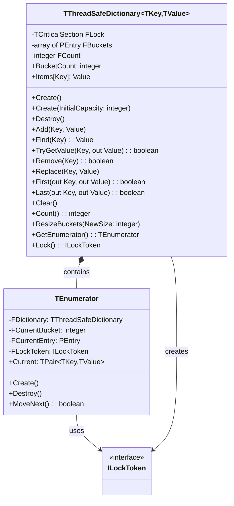

# ThreadSafeDictionary Documentation

A thread-safe, generic dictionary implementation in Free Pascal using separate chaining for collision resolution.

## Quick Start

### Basic Types (string, integer)
```pascal
var
  StringIntDict: specialize TThreadSafeDictionary<string, integer>;
  IntStringDict: specialize TThreadSafeDictionary<integer, string>;
begin
  // Simple creation - uses built-in hash functions
  StringIntDict := TThreadSafeDictionary.Create;
  IntStringDict := TThreadSafeDictionary.Create;
  try
    StringIntDict.Add('one', 1);
    IntStringDict.Add(1, 'one');
  finally
    StringIntDict.Free;
    IntStringDict.Free;
  end;
end;
```

### Custom/Compound Types
```pascal
type
  TPersonKey = record
    FirstName: string;
    LastName: string;
  end;

// Define hash function
function HashPerson(const Key: TPersonKey): Cardinal;
begin
  Result := XXHash32(Key.FirstName + '|' + Key.LastName);
end;

// Define equality comparison
function ComparePerson(const Left, Right: TPersonKey): Boolean;
begin
  Result := (Left.FirstName = Right.FirstName) and 
            (Left.LastName = Right.LastName);
end;

var
  PersonDict: specialize TThreadSafeDictionary<TPersonKey, integer>;
begin
  // Create with custom hash and equality functions
  PersonDict := TThreadSafeDictionary.Create(@HashPerson, @ComparePerson);
  try
    var Person: TPersonKey;
    Person.FirstName := 'John';
    Person.LastName := 'Doe';
    PersonDict.Add(Person, 42);
  finally
    PersonDict.Free;
  end;
end;
```

## Hash Functions

### Built-in Hash Functions
The dictionary includes efficient built-in hash functions for common types:

| Type | Hash Function | Description |
|------|--------------|-------------|
| string | XXHash32 | Fast non-cryptographic hash, good distribution |
| integer | MultiplicativeHash | Efficient integer hash function |
| other types | DefaultHash | Generic fallback hash function |

You don't need to provide hash functions for basic types - the dictionary automatically uses the appropriate built-in function.

### Custom Hash Functions
For compound or custom types, you must provide:
1. A hash function: `function(const Key: T): Cardinal`
2. An equality comparison function: `function(const Left, Right: T): Boolean`

Example:
```pascal
// Hash function for a record type
function HashMyRecord(const Key: TMyRecord): Cardinal;
begin
  Result := XXHash32(Key.Field1 + '|' + Key.Field2);
end;

// Equality comparison for a record type
function CompareMyRecord(const Left, Right: TMyRecord): Boolean;
begin
  Result := (Left.Field1 = Right.Field1) and (Left.Field2 = Right.Field2);
end;

// Create dictionary with custom functions
Dict := TThreadSafeDictionary.Create(@HashMyRecord, @CompareMyRecord);
```

## Constructors

### Basic Creation
```pascal
// Default constructor - uses built-in hash for basic types
Dict := TThreadSafeDictionary.Create;

// With initial capacity (will be rounded to next power of 2)
Dict := TThreadSafeDictionary.Create(32);
```

### Custom Types Creation
```pascal
// With custom hash functions
Dict := TThreadSafeDictionary.Create(@MyHashFunc, @MyEqualityFunc);

// With initial capacity and custom functions
Dict := TThreadSafeDictionary.Create(32, @MyHashFunc, @MyEqualityFunc);
```

## Architecture Diagram



## Collision Resolution Strategies

### Separate Chaining (What We Use)

```
┌─────────────┐
│ Bucket[0]   │──► [Key:A, Value:1] ──► [Key:E, Value:5] ──► null
├─────────────┤
│ Bucket[1]   │──► [Key:B, Value:2] ──► null
├─────────────┤
│ Bucket[2]   │──► null
├─────────────┤
│ Bucket[3]   │──► [Key:C, Value:3] ──► [Key:F, Value:6] ──► null
├─────────────┤
│ Bucket[4]   │──► [Key:D, Value:4] ──► null
└─────────────┘
```
- Each bucket is a linked list
- Multiple items can exist in same bucket
- No need to find another slot
- Memory usage grows with collisions
- Our implementation uses this approach

### Double Hashing (Alternative)

```
┌─────────────┐
│ Bucket[0]   │  A
├─────────────┤
│ Bucket[1]   │  B
├─────────────┤
│ Bucket[2]   │  empty
├─────────────┤
│ Bucket[3]   │  C
├─────────────┤
│ Bucket[4]   │  D
└─────────────┘

When collision occurs at index i:
Next = (i + step * h2(key)) % tableSize
where h2(key) is a second hash function
```
- Uses two hash functions
- On collision, calculates new positions
- All items stored in main array
- Can lead to clustering
- More complex to implement

Key Differences:

1. **Storage Structure**
   - Separate Chaining: Uses linked lists
   - Double Hashing: Uses only the main array

2. **Collision Handling**
   - Separate Chaining: Simply adds to list
   - Double Hashing: Probes for next empty slot

3. **Memory Usage**
   - Separate Chaining: Can grow beyond array size
   - Double Hashing: Limited to array size

4. **Performance**
   - Separate Chaining: Consistent but may need list traversal
   - Double Hashing: Fast when load factor is low, degrades with more collisions

5. **Implementation Complexity**
   - Separate Chaining: Simpler to implement
   - Double Hashing: More complex, needs careful second hash function selection

6. **Load Factor Impact**
   - Separate Chaining: Can handle load factor > 1
   - Double Hashing: Must keep load factor < 1

## API Reference

### Constructor/Destructor
- `Create`: Creates a new dictionary with default bucket size (16)
- `Create(InitialCapacity: integer)`: Creates dictionary with specified initial capacity (adjusted to power of 2)
- `Destroy`: Cleans up all entries and frees resources

### Core Operations
| Method | Description | Return Type | Thread-Safe |
|--------|-------------|-------------|-------------|
| `Add(const Key: TKey; const Value: TValue)` | Adds new key-value pair | void | Yes |
| `Find(const Key: TKey)` | Retrieves value for key (raises exception if not found) | TValue | Yes |
| `TryGetValue(const Key: TKey; out Value: TValue)` | Safe value retrieval | Boolean | Yes |
| `Remove(const Key: TKey)` | Removes entry with given key | Boolean | Yes |
| `Replace(const Key: TKey; const Value: TValue)` | Updates value for existing key (raises exception if not found) | void | Yes |

### Iterator Support

```pascal
type
  TPair = record
    Key: TKey;
    Value: TValue;
  end;
  
  TEnumerator = class
    private
      FDictionary: TThreadSafeDictionary;
      FCurrentBucket: Integer;
      FCurrentEntry: PEntry;
      FLockToken: ILockToken;
      function GetCurrent: TPair<TKey, TValue>;
    public
      constructor Create(ADictionary: TThreadSafeDictionary);
      destructor Destroy; override;
      function MoveNext: Boolean;
      property Current: TPair<TKey, TValue> read GetCurrent;
    end;
  
function GetEnumerator: TEnumerator;
```

#### Usage Example
```pascal
var
  Dict: specialize TThreadSafeDictionary<string, integer>;
  Pair: specialize TPair<string, integer>;
begin
  Dict := specialize TThreadSafeDictionary<string, integer>.Create;
  try
    Dict.Add('one', 1);
    Dict.Add('two', 2);
    
    // Using iterator
    for Pair in Dict do
      WriteLn(Format('%s: %d', [Pair.Key, Pair.Value]));
  finally
    Dict.Free;
  end;
end;
```

#### Iterator Characteristics
- Returns key-value pairs during iteration
- Thread-safe through RAII locking
- Automatic lock acquisition and release
- Exception-safe lock management
- Forward-only iteration
- Protected from modifications during iteration (via RAII lock)
- Other threads must wait for iteration to complete before modifying

### Navigation
| Method | Description | Return Type | Thread-Safe |
|--------|-------------|-------------|-------------|
| `First(out Key: TKey; out Value: TValue)` | Gets first entry in first non-empty bucket | Boolean | Yes |
| `Last(out Key: TKey; out Value: TValue)` | Gets first entry in last non-empty bucket | Boolean | Yes |

### Maintenance
| Method/Property | Description | Type | Thread-Safe |
|----------------|-------------|------|-------------|
| `Clear` | Removes all entries | void | Yes |
| `Count` | Returns number of items | Integer | Yes |
| `ResizeBuckets(NewSize: integer)` | Manually resizes bucket array | void | Yes |
| `BucketCount` | Returns current number of buckets | Integer | Yes |
| `Items[Key: TKey]` | Default array property for access/update | TValue | Yes |

### Constants
```pascal
const
  DEBUG_LOGGING = False;         // Enable/disable debug output
  INITIAL_BUCKET_COUNT = 16;     // Default initial size
  LOAD_FACTOR = 0.75;           // Resize threshold
  MIN_BUCKET_COUNT = 4;         // Minimum bucket count
```

### Implementation Details
- Uses `TCriticalSection` for thread synchronization
- Separate chaining for collision resolution
- Automatic resizing when load factor exceeds 0.75
- Bucket count always power of 2 for efficient indexing
- Hash values cached in entries for efficient resizing

### Performance Characteristics
- Average case complexity:
  - Add: O(1)
  - Find/TryGetValue: O(1)
  - Remove: O(1)
  - Replace: O(1)
  - First/Last: O(n) worst case
  - Clear: O(n)
  - Resize: O(n)

### Usage Example

```pascal
var
  Dict: specialize TThreadSafeDictionary<string, integer>;
begin
  Dict := TThreadSafeDictionary.Create;
  try
    // Add items
    Dict.Add('one', 1);
    
    // Access via default property
    Dict['two'] := 2;
    
    // Safe value retrieval
    var Value: Integer;
    if Dict.TryGetValue('one', Value) then
      WriteLn(Value);
      
    // Replace existing value
    Dict.Replace('one', 100);
    
    // Access via default property
    WriteLn(Dict['one']); // Outputs: 100
  finally
    Dict.Free;
  end;
end;
```

### Usage Example with Initial Capacity

```pascal
var
  Dict: specialize TThreadSafeDictionary<string, integer>;
begin
  // Create with custom initial capacity (will be adjusted to 1024)
  Dict := TThreadSafeDictionary.Create(1000);
  try
    // Add items
    Dict.Add('one', 1);
    Dict.Add('two', 2);

    // Check current bucket count
    WriteLn(Format('Bucket count: %d', [Dict.BucketCount]));

    // Manually resize if needed (will be adjusted to next power of 2)
    Dict.ResizeBuckets(2000);

    // Verify items still accessible
    WriteLn(Dict.Find('one'));  // Outputs: 1
  finally
    Dict.Free;
  end;
end;
```

## Best Practices

1. Memory Management
   - Always use try-finally blocks
   - Call Free when done
   - Clear removes all items but maintains buckets

2. Thread Safety
   - All operations are internally synchronized
   - No need for external locking
   - Keep operations atomic for best performance

3. Performance Optimization
   - Initialize with expected size if known
   - Use TryGetValue instead of Find when appropriate
   - Consider key distribution for hash efficiency

4. Capacity Management
   - Use custom initial capacity for known data sizes
   - Consider growth pattern when using manual resize
   - Remember minimum bucket count constraint
   - Account for load factor in size calculations

## Known Limitations

1. First/Last operations are not order-preserving
2. No bulk operations
3. No concurrent iteration support

## Debugging

Set `DEBUG_LOGGING := True` for detailed operation logging:
```pascal
const
  DEBUG_LOGGING = True;  // Enable debug output
```