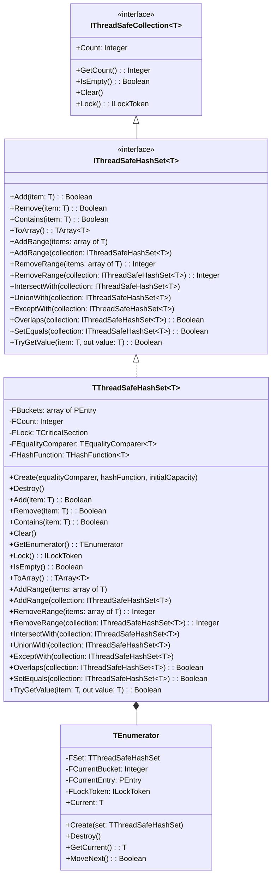

# ThreadSafeCollections.HashSet Documentation

## Table of Contents
- [ThreadSafeCollections.HashSet Documentation](#threadsafecollectionshashset-documentation)
  - [Table of Contents](#table-of-contents)
  - [Dependencies and Features](#dependencies-and-features)
    - [Dependencies](#dependencies)
    - [Features](#features)
  - [Quick Start](#quick-start)
    - [Basic Types (integer, string)](#basic-types-integer-string)
    - [Custom Types](#custom-types)
  - [Architecture and Design](#architecture-and-design)
    - [Class Diagram](#class-diagram)
    - [Collision Resolution](#collision-resolution)
      - [Separate Chaining (What We Use)](#separate-chaining-what-we-use)
  - [API Reference](#api-reference)
    - [Constructors](#constructors)
    - [Core Operations](#core-operations)
    - [Bulk Operations](#bulk-operations)
    - [Set Operations](#set-operations)
    - [Iterator Support](#iterator-support)
      - [Usage Example](#usage-example)
      - [Iterator Characteristics](#iterator-characteristics)
    - [Utility Methods](#utility-methods)
    - [Properties](#properties)
    - [Constants](#constants)
  - [Implementation Details](#implementation-details)
    - [Built-in Hash Functions](#built-in-hash-functions)
    - [Thread Safety](#thread-safety)
    - [Load Factor and Resizing](#load-factor-and-resizing)
  - [Performance](#performance)
    - [Complexity Analysis](#complexity-analysis)
    - [Performance Characteristics](#performance-characteristics)
  - [Usage Examples](#usage-examples)
    - [Basic Usage](#basic-usage)
    - [Custom Types](#custom-types-1)
    - [Set Operations](#set-operations-1)
    - [Bulk Operations](#bulk-operations-1)
    - [Iterator Usage](#iterator-usage)
  - [Best Practices](#best-practices)
  - [Known Limitations](#known-limitations)
  - [Debugging](#debugging)

## Dependencies and Features

### Dependencies
- Free Pascal 3.2.2 or later
- SyncObjs unit (for thread synchronization)
- HashFunctions unit (for built-in hash functions)

### Features
- Thread-safe operations using critical sections
- Separate chaining for collision resolution
- Automatic resizing when load factor exceeds 75%
- Support for custom hash functions and equality comparers
- Specialized implementations for common types
- RAII-style locking mechanism
- Thread-safe iteration support

## Quick Start

### Basic Types (integer, string)
```pascal
var
  IntSet: TThreadSafeHashSetInteger;
  StrSet: TThreadSafeHashSetString;
begin
  // Integer set
  IntSet := TThreadSafeHashSetInteger.Create;
  try
    IntSet.Add(42);
    WriteLn(IntSet.Contains(42)); // True
  finally
    IntSet.Free;
  end;
  
  // String set
  StrSet := TThreadSafeHashSetString.Create;
  try
    StrSet.Add('test');
    WriteLn(StrSet.Contains('test')); // True
  finally
    StrSet.Free;
  end;
end;
```

### Custom Types
```pascal
type
  TPoint = record
    X, Y: Integer;
  end;

function PointEquals(const A, B: TPoint): Boolean;
begin
  Result := (A.X = B.X) and (A.Y = B.Y);
end;

function PointHash(const Value: TPoint): Cardinal;
begin
  Result := Cardinal(Value.X xor Value.Y);
end;

var
  Points: specialize TThreadSafeHashSet<TPoint>;
begin
  Points := specialize TThreadSafeHashSet<TPoint>.Create(@PointEquals, @PointHash);
  try
    Points.Add(TPoint.Create(1, 1));
  finally
    Points.Free;
  end;
end;
```

## Architecture and Design

### Class Diagram


### Collision Resolution

#### Separate Chaining (What We Use)
- Each bucket contains a linked list of entries
- New items are added to the front of the list
- Provides good performance even with many collisions
- Memory usage scales with number of items

## API Reference

### Constructors
```pascal
constructor Create(AEqualityComparer: TEqualityComparer<T>;
                  AHashFunction: THashFunction<T>;
                  AInitialCapacity: Integer = INITIAL_BUCKET_COUNT);
```

### Core Operations
```pascal
function Add(const Item: T): Boolean;
function Remove(const Item: T): Boolean;
function Contains(const Item: T): Boolean;
procedure Clear;
```

### Bulk Operations
```pascal
procedure AddRange(const Items: array of T);
procedure AddRange(const Collection: specialize IThreadSafeHashSet<T>);
function RemoveRange(const Items: array of T): Integer;
function RemoveRange(const Collection: specialize IThreadSafeHashSet<T>): Integer;
```

### Set Operations
```pascal
procedure IntersectWith(const Collection: specialize IThreadSafeHashSet<T>);
procedure UnionWith(const Collection: specialize IThreadSafeHashSet<T>);
procedure ExceptWith(const Collection: specialize IThreadSafeHashSet<T>);
function Overlaps(const Collection: specialize IThreadSafeHashSet<T>): Boolean;
function SetEquals(const Collection: specialize IThreadSafeHashSet<T>): Boolean;
```

### Iterator Support

```pascal
function GetEnumerator: TEnumerator;
```

#### Usage Example
```pascal
var
  Item: Integer;
  Set: TThreadSafeHashSetInteger;
begin
  Set := TThreadSafeHashSetInteger.Create;
  try
    Set.Add(1);
    Set.Add(2);
    for Item in Set do
      WriteLn(Item);
  finally
    Set.Free;
  end;
end;
```

#### Iterator Characteristics
- Thread-safe through RAII locking
- Forward-only iteration
- No modification during iteration
- Automatic lock release

### Utility Methods
```pascal
function TryGetValue(const Item: T; out Value: T): Boolean;
function ToArray: specialize TArray<T>;
function IsEmpty: Boolean;
function Lock: ILockToken;
```

### Properties
```pascal
property Count: Integer read GetCount;
```

### Constants
```pascal
const
  INITIAL_BUCKET_COUNT = 16;
  LOAD_FACTOR = 0.75;
  MIN_BUCKET_COUNT = 4;
```

## Implementation Details

### Built-in Hash Functions
- Integer: Multiplicative hash
- String: XXHash32
- Boolean: Direct value hash
- Real: Fixed-point conversion hash

### Thread Safety
- Uses `TCriticalSection` for synchronization
- RAII-style locking through `ILockToken`
- All operations are mutually exclusive

### Load Factor and Resizing
- Triggers resize at 75% capacity
- Doubles bucket count on resize
- Rehashes all existing items
- No automatic shrinking

## Performance

### Complexity Analysis
- Add: O(1) average, O(n) worst
- Remove: O(1) average, O(n) worst
- Contains: O(1) average, O(n) worst
- Clear: O(n)
- Resize: O(n)

### Performance Characteristics
Based on test results with FPC 3.2.2 (Windows 11, 11th Gen Intel(R) Core(TM) i7-11800H @ 2.30GHz, 2304 Mhz, 8 Core(s), 16 Logical Processors, 32 Gb RAM):

| Operation | Time (ms) | Items | Notes |
|-----------|-----------|-------|-------|
| Basic Operations | 0.006 | 10,000 | Add/Contains operations |
| Large Dataset | 1.562 | 100,000 | Sequential adds |
| Concurrent Access | 0.120 | 4 threads | Basic thread safety |
| Stress Test | 0.157 | 4,000 ops | Mixed operations |
| Hash Collisions | 0.797 | 10,000 | Collision handling |
| Aggressive Collisions | 35.608 | 10,000 | Worst-case scenario |
| Iterator Operations | 0.005 | 1,000 | Basic iteration |
| Iterator Stress | 8.112 | 10,000 | Concurrent iteration |
| Lock Mechanism | 31.266 | 4,000 locks | Lock contention |
| Bulk Add (Array) | 0.032 | 100,000 | AddRange operation |
| Bulk Add (Collection) | 0.052 | 100,000 | AddRange from set |
| Bulk Remove | 0.180 | 50,000 | RemoveRange operation |
| Set Operations | < 0.001 | 1,000 | Union/Intersect/Except |

## Usage Examples

### Basic Usage
```pascal
var
  IntSet: TThreadSafeHashSetInteger;
begin
  IntSet := TThreadSafeHashSetInteger.Create;
  try
    IntSet.Add(42);
    IntSet.Add(17);
    
    if IntSet.Contains(42) then
      WriteLn('Found 42');
      
    IntSet.Remove(17);
  finally
    IntSet.Free;
  end;
end;
```

### Custom Types
```pascal
type
  TCustomer = record
    ID: Integer;
    Name: string;
  end;

function CustomerEquals(const A, B: TCustomer): Boolean;
begin
  Result := (A.ID = B.ID) and (A.Name = B.Name);
end;

function CustomerHash(const Value: TCustomer): Cardinal;
begin
  Result := XXHash32(Value.Name) xor MultiplicativeHash(Cardinal(Value.ID));
end;

var
  Customers: specialize TThreadSafeHashSet<TCustomer>;
begin
  Customers := specialize TThreadSafeHashSet<TCustomer>.Create(@CustomerEquals, @CustomerHash);
  try
    // Use the set...
  finally
    Customers.Free;
  end;
end;
```

### Set Operations
```pascal
var
  SetA, SetB: TThreadSafeHashSetInteger;
begin
  SetA := TThreadSafeHashSetInteger.Create;
  SetB := TThreadSafeHashSetInteger.Create;
  try
    // Setup sets
    SetA.Add(1);
    SetA.Add(2);
    SetA.Add(3);
    
    SetB.Add(2);
    SetB.Add(3);
    SetB.Add(4);
    
    // Intersection
    SetA.IntersectWith(SetB);  // SetA now contains {2, 3}
    
    // Union
    SetA.UnionWith(SetB);      // SetA now contains {1, 2, 3, 4}
    
    // Difference
    SetA.ExceptWith(SetB);     // SetA now contains {1}
  finally
    SetA.Free;
    SetB.Free;
  end;
end;
```

### Bulk Operations
```pascal
var
  Numbers: array of Integer;
  Set: TThreadSafeHashSetInteger;
begin
  Set := TThreadSafeHashSetInteger.Create;
  try
    // Add multiple items at once
    SetLength(Numbers, 3);
    Numbers[0] := 1;
    Numbers[1] := 2;
    Numbers[2] := 3;
    
    Set.AddRange(Numbers);
    
    // Remove multiple items
    SetLength(Numbers, 2);
    Numbers[0] := 1;
    Numbers[1] := 2;
    
    Set.RemoveRange(Numbers);
  finally
    Set.Free;
  end;
end;
```

### Iterator Usage
```pascal
var
  Set: TThreadSafeHashSetInteger;
  Item: Integer;
begin
  Set := TThreadSafeHashSetInteger.Create;
  try
    Set.Add(1);
    Set.Add(2);
    Set.Add(3);
    
    // Safe iteration with automatic locking
    for Item in Set do
      WriteLn(Item);
  finally
    Set.Free;
  end;
end;
```

## Best Practices
1. Always use try-finally blocks for proper cleanup
2. Use bulk operations when adding/removing multiple items
3. Choose appropriate initial capacity to minimize resizing
4. Consider custom hash functions for special use cases
5. Monitor performance under heavy collision scenarios
6. Use specialized types (`TThreadSafeHashSetInteger`, etc.) when possible

## Known Limitations
1. Single lock for all operations (potential contention)
2. No shrinking after removals
3. No concurrent iteration and modification
4. Memory overhead from separate chaining
5. Performance degrades under heavy collisions
6. No built-in serialization support

## Debugging
Enable detailed logging:
```pascal
const
  DEBUG_LOGGING = True;  // Enable debug output
```

Performance monitoring:
```pascal
var
  StartTime: TDateTime;
begin
  StartTime := Now;
  // ... operations ...
  WriteLn('Operation took: ', MilliSecondsBetween(Now, StartTime), 'ms');
end;
```