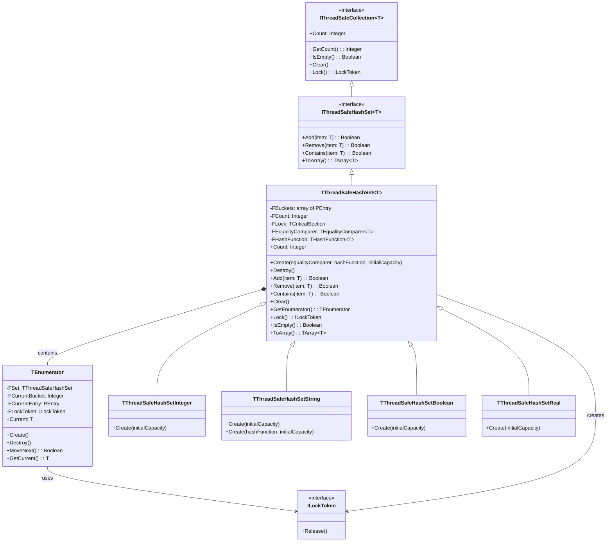

# ThreadSafeHashSet Documentation

## Overview
ThreadSafeHashSet is a generic, thread-safe implementation of a hash set in Free Pascal. It provides concurrent access safety while maintaining high performance through separate chaining for collision resolution.

## Class Diagram




## Core Features
- Thread-safe operations
- Automatic resizing when load factor exceeds 75%
- Separate chaining for collision handling
- Generic implementation with specialized versions for common types
- Custom hash function support (especially for testing)
- RAII-style locking through interface counting
- Thread-safe iteration support

### Iterator Support

```pascal
type
  TIterator = class(TObject)
  public
    function MoveNext: Boolean;
    function GetCurrent: T;
    property Current: T read GetCurrent;
  end;

function GetEnumerator: TIterator;
```

#### Usage Example
```pascal
var
  Set: TThreadSafeHashSetString;
  Item: string;
begin
  Set := TThreadSafeHashSetString.Create;
  try
    Set.Add('one');
    Set.Add('two');
    
    // Using iterator
    for Item in Set do
      WriteLn(Item);
  finally
    Set.Free;
  end;
end;
```

#### Iterator Characteristics
- Thread-safe within single thread context
- Uses read locks during iteration
- Forward-only iteration
- Protected from modifications during iteration (via read locks)
- Other threads must wait for iteration to complete before modifying
- No guaranteed iteration order (due to hash table structure)

## API Reference

### Generic TThreadSafeHashSet<T>

#### Constructor

```pascal
constructor Create(AEqualityComparer: TEqualityComparer<T>;
                   AHashFunction: THashFunction<T>;
                   AInitialCapacity: Integer = 16);
```


#### Methods
| Method | Description | Return Type |
|--------|-------------|-------------|
| `Add(const Item: T)` | Adds an item to the set. Returns True if item was added, False if it already existed | Boolean |
| `Remove(const Item: T)` | Removes an item from the set. Returns True if item was found and removed, False if not found | Boolean |
| `Contains(const Item: T)` | Checks if an item exists in the set. Returns True if found | Boolean |
| `Clear` | Removes all items from the set | void |

#### Properties
| Property | Description | Type | Thread-Safe |
|----------|-------------|------|-------------|
| `Count` | Number of items currently in the set | Integer | Yes |

> [!NOTE]
> All methods are thread-safe and protected by internal critical section.

### Specialized Types

#### TThreadSafeHashSetInteger
```pascal
var
  IntSet: TThreadSafeHashSetInteger;
begin
  IntSet := TThreadSafeHashSetInteger.Create;
  try
    IntSet.Add(42);
    IntSet.Contains(42); // Returns True
  finally
    IntSet.Free;
  end;
end;
```

#### TThreadSafeHashSetString
```pascal
var
  StrSet: TThreadSafeHashSetString;
begin
  StrSet := TThreadSafeHashSetString.Create;
  try
    StrSet.Add('Hello');
    StrSet.Contains('Hello'); // Returns True
  finally
    StrSet.Free;
  end;
end;
```

#### TThreadSafeHashSetBoolean
```pascal
var
  BoolSet: TThreadSafeHashSetBoolean;
begin
  BoolSet := TThreadSafeHashSetBoolean.Create;
  try
    BoolSet.Add(True);
    BoolSet.Add(False);
    BoolSet.Contains(True);  // Returns True
    BoolSet.Contains(False); // Returns True
  finally
    BoolSet.Free;
  end;
end;
```

#### TThreadSafeHashSetReal
```pascal
var
  RealSet: TThreadSafeHashSetReal;
begin
  RealSet := TThreadSafeHashSetReal.Create;
  try
    RealSet.Add(3.14159);
    RealSet.Add(2.71828);
    RealSet.Contains(3.14159); // Returns True
    // Note: Be careful with floating-point equality comparisons
  finally
    RealSet.Free;
  end;
end;
```

> [!NOTE] 
> When using `TThreadSafeHashSetReal`, be aware that floating-point comparisons might be affected by precision issues. Consider using a custom equality comparer if you need specific precision handling.


### Custom Types Usage

```pascal
type
  TMyRecord = record
    Name: string;
    Value: Integer;
  end;

function MyRecordEquals(const A, B: TMyRecord): Boolean;
begin
  Result := (A.Name = B.Name) and (A.Value = B.Value);
end;

function MyRecordHash(const Value: TMyRecord): Cardinal;
begin
  Result := XXHash32(Value.Name) xor MultiplicativeHash(Cardinal(Value.Value));
end;

var
  CustomSet: specialize TThreadSafeHashSet<TMyRecord>;

begin
  CustomSet := specialize TThreadSafeHashSet<TMyRecord>.Create(@MyRecordEquals, @MyRecordHash);
  try
    // Use the set...
  finally
    CustomSet.Free;
  end;
end;
```


## Thread Safety
All public methods are protected by a critical section, ensuring thread-safe operations:
- Multiple threads can safely add/remove items concurrently
- Automatic resizing is thread-safe
- Count property access is thread-safe

## Performance Characteristics
- Average case O(1) for Add/Remove/Contains
- Worst case O(n) when all items hash to same bucket
- Automatic resizing keeps operations efficient
- Load factor of 0.75 balances memory usage and performance

## Testing Support

Special constructor in TThreadSafeHashSetString supports custom hash functions for testing:


```pascal
var
  TestSet: TThreadSafeHashSetString;

begin
  TestSet := TThreadSafeHashSetString.Create(@ForceCollisionHash);
  try
    // All items will hash to same bucket ($DEADBEEF)
  finally
    TestSet.Free;
  end;
end;
```


## Implementation Details
The implementation uses:
- Separate chaining for collision resolution
- Critical sections for thread synchronization
- Cached hash codes for better performance
- Power-of-two bucket counts for efficient indexing

## Known Limitations

1. **No Iterator Support**
   - No built-in mechanism for safe iteration over items
   - No foreach-style enumeration
   - Must extract items individually using `Contains`/`Remove`

2. **No Bulk Operations**
   - No batch Add/Remove operations
   - Each operation requires separate lock acquisition
   - Performance impact when adding/removing multiple items

3. **Floating-Point Precision**
   - `TThreadSafeHashSetReal` uses direct equality comparison
   - May have precision issues with floating-point numbers
   - Consider custom equality comparer for specific precision needs

4. **Memory Usage**
   - Separate chaining can use more memory than open addressing
   - Each entry requires additional pointer overhead
   - No automatic bucket count reduction when items removed

5. **Concurrent Access Characteristics**
   - Uses `TCriticalSection` for guaranteed thread safety
   - Single lock strategy (simple but potentially less concurrent)
   - All operations are mutually exclusive
   
   Performance Considerations:
   - Multiple threads may wait when concurrent access occurs
   - Best performance when contention is low
   - Consider alternative collections if you need:
     * Reader/writer separation
     * Lock-free operations
     * Higher concurrent throughput

6. **Custom Type Limitations**
   - Must manually implement hash and equality functions
   - No default implementations for complex types
   - No compile-time validation of hash function quality

7. **Resizing Behavior**
   - Only grows, never shrinks
   - No way to manually reduce capacity
   - May hold more memory than needed after many removals