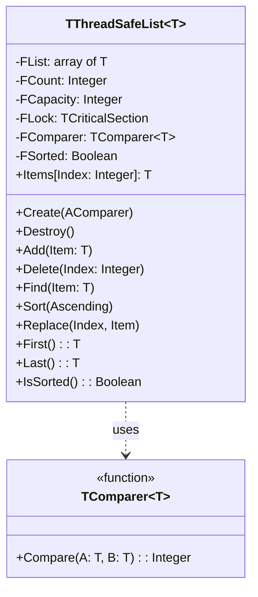

# ThreadSafeCollections.List API Documentation

## Component Diagram


    
## Core Components

### TComparer<T>
Generic function type for comparing elements:
- Input: Two elements of type T (A and B)
- Returns: Integer (-1, 0, or 1)
- Usage: Determines element ordering for sorting and finding

### TThreadSafeList<T>
Thread-safe generic list implementation with built-in synchronization.

#### Properties
- `Count: Integer` - Number of elements in the list
- `Items[Index: Integer]: T` - Default array property for access

#### Thread Safety Features
- All public methods are protected by `TCriticalSection`
- Automatic locking/unlocking for all operations
- Exception-safe lock management

#### Methods

##### Constructor

```pascal
constructor Create(AComparer: specialize TComparer<T>);
```

- Creates new list with specified comparer
- Throws exception if comparer is nil

##### Basic Operations

```pascal
function Add(const Item: T): Integer;
procedure Delete(Index: Integer);
function Find(const Item: T): Integer;
procedure Replace(Index: Integer; const Item: T);
```


##### Sorting and Order

```pascal
procedure Sort(Ascending: Boolean = True);
function IsSorted: Boolean;
function First: T;
function Last: T;
```

Sorts the list elements using QuickSort algorithm:
- `Ascending = True` (default): Elements sorted in ascending order (A to Z, 1 to 9)
- `Ascending = False`: Elements sorted in descending order (Z to A, 9 to 1)
- Thread-safe: Protected by critical section
- Time complexity: O(n log n)

Examples:
```pascal
// Ascending order (default)
List.Sort;  // or List.Sort(True);
// [1, 2, 3, 4, 5]

// Descending order
List.Sort(False);
// [5, 4, 3, 2, 1]
```

##### Sort Order with Custom Types
When using custom comparers, the sort order follows the comparer's logic:

```pascal
// Custom student record sorting
type
  TStudent = record
    Name: string;
    ID: Integer;
  end;

// Sort by name
function StudentNameComparer(const A, B: TStudent): Integer;
begin
  Result := CompareStr(A.Name, B.Name);
end;

var
  Students: specialize TThreadSafeList<TStudent>;
begin
  Students := specialize TThreadSafeList<TStudent>.Create(@StudentNameComparer);
  try
    // ... add students ...
    
    Students.Sort;      // A to Z order
    Students.Sort(False); // Z to A order
  finally
    Students.Free;
  end;
end;
```

## Built-in Comparers

```pascal
function IntegerComparer(const A, B: Integer): Integer;
function StringComparer(const A, B: string): Integer;
function BooleanComparer(const A, B: Boolean): Integer;
function RealComparer(const A, B: Real): Integer;
```

## Usage Examples

### Basic Integer List

```pascal
var
    List: specialize TThreadSafeList<Integer>;

begin
    List := specialize TThreadSafeList<Integer>.Create(@IntegerComparer);
    try
        List.Add(42);
        List.Add(17);
        List.Sort;
    finally
        List.Free;
    end;
end;
```

### Custom Type with Custom Comparer


```pascal
type
    TStudent = record
    Name: string;
    ID: Integer;
end;

function StudentNameComparer(const A, B: TStudent): Integer;
begin
    Result := CompareStr(A.Name, B.Name);
end;

var
    Students: specialize TThreadSafeList<TStudent>;

begin
    Students := specialize TThreadSafeList<TStudent>.Create(@StudentNameComparer);
    try 
        // Use the list...
    finally
    Students.Free;
end;
```

## Performance Considerations

- Growing strategy: Double capacity when full
- QuickSort implementation for sorting
- Lock contention in multi-threaded scenarios
- O(1) for Add (amortized)
- O(n) for Find
- O(n log n) for Sort