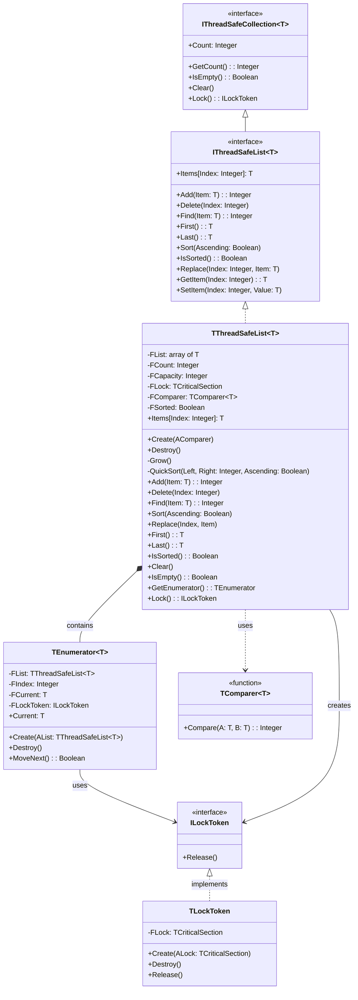

# ThreadSafeCollections.List API Documentation

## Component Diagram


    
## Core Components

### TComparer<T>
Generic function type for comparing elements:
- Input: Two elements of type T (A and B)
- Returns: Integer (-1, 0, or 1)
- Usage: Determines element ordering for sorting and finding

### TThreadSafeList<T>
Thread-safe generic list implementation with built-in synchronization.

#### Properties
- `Count: Integer` - Number of elements in the list
- `Items[Index: Integer]: T` - Default array property for access

#### Thread Safety Features
- All public methods are protected by `TCriticalSection`
- Automatic locking/unlocking for all operations
- Exception-safe lock management

#### Methods

##### Constructor

```pascal
constructor Create(AComparer: specialize TComparer<T>);
```

- Creates new list with specified comparer
- Throws exception if comparer is nil

##### Basic Operations

```pascal
function Add(const Item: T): Integer;
procedure Delete(Index: Integer);
function Find(const Item: T): Integer;
procedure Replace(Index: Integer; const Item: T);
```


##### Sorting and Order

```pascal
procedure Sort(Ascending: Boolean = True);
function IsSorted: Boolean;
function First: T;
function Last: T;
```

Sorts the list elements using QuickSort algorithm:
- `Ascending = True` (default): Elements sorted in ascending order (A to Z, 1 to 9)
- `Ascending = False`: Elements sorted in descending order (Z to A, 9 to 1)
- Thread-safe: Protected by critical section
- Time complexity: O(n log n)

Examples:
```pascal
// Ascending order (default)
List.Sort;  // or List.Sort(True);
// [1, 2, 3, 4, 5]

// Descending order
List.Sort(False);
// [5, 4, 3, 2, 1]
```

##### Sort Order with Custom Types
When using custom comparers, the sort order follows the comparer's logic:

```pascal
// Custom student record sorting
type
  TStudent = record
    Name: string;
    ID: Integer;
  end;

// Sort by name
function StudentNameComparer(const A, B: TStudent): Integer;
begin
  Result := CompareStr(A.Name, B.Name);
end;

var
  Students: specialize TThreadSafeList<TStudent>;
begin
  Students := specialize TThreadSafeList<TStudent>.Create(@StudentNameComparer);
  try
    // ... add students ...
    
    Students.Sort;      // A to Z order
    Students.Sort(False); // Z to A order
  finally
    Students.Free;
  end;
end;
```

### Iterator Support

```pascal
type
  TIterator = class(TObject)
  public
    function MoveNext: Boolean;
    function GetCurrent: T;
    property Current: T read GetCurrent;
  end;

function GetEnumerator: TIterator;
```

#### Usage Example
```pascal
var
  List: specialize TThreadSafeList<Integer>;
  Item: Integer;
begin
  List := specialize TThreadSafeList<Integer>.Create(@IntegerComparer);
  try
    List.Add(1);
    List.Add(2);
    List.Add(3);
    
    // Using iterator
    for Item in List do
      WriteLn(Item);
  finally
    List.Free;
  end;
end;
```

#### Iterator Characteristics
- Thread-safe through RAII locking
- Automatic lock acquisition and release
- Exception-safe lock management
- Forward-only iteration
- Protected from modifications during iteration (via RAII lock)
- Other threads must wait for iteration to complete before modifying

## Built-in Comparers

```pascal
function IntegerComparer(const A, B: Integer): Integer;
function StringComparer(const A, B: string): Integer;
function BooleanComparer(const A, B: Boolean): Integer;
function RealComparer(const A, B: Real): Integer;
```

## Usage Examples

### Basic Integer List

```pascal
var
    List: specialize TThreadSafeList<Integer>;

begin
    List := specialize TThreadSafeList<Integer>.Create(@IntegerComparer);
    try
        List.Add(42);
        List.Add(17);
        List.Sort;
    finally
        List.Free;
    end;
end;
```

### Custom Type with Custom Comparer


```pascal
type
    TStudent = record
    Name: string;
    ID: Integer;
end;

function StudentNameComparer(const A, B: TStudent): Integer;
begin
    Result := CompareStr(A.Name, B.Name);
end;

var
    Students: specialize TThreadSafeList<TStudent>;

begin
    Students := specialize TThreadSafeList<TStudent>.Create(@StudentNameComparer);
    try 
        // Use the list...
    finally
    Students.Free;
end;
```

## Performance Considerations

- Growing strategy: Double capacity when full
- QuickSort implementation for sorting
- Lock contention in multi-threaded scenarios
- O(1) for Add (amortized)
- O(n) for Find
- O(n log n) for Sort


## Known Limitations

1. **Iterator Limitations**
   - Forward-only iteration
   - No concurrent modification detection
   - Must wait for iteration to complete before modifying

2. **No Bulk Operations**
   - No batch Add/Delete operations
   - Each operation requires separate lock acquisition
   - Performance impact when modifying multiple items

3. **Sorting Limitations**
   - Sort operation blocks all other access
   - No parallel sorting implementation
   - FSorted flag may cause unnecessary sorts

4. **Memory Management**
   - Only grows, never shrinks
   - No manual capacity reduction
   - May hold excess memory after many deletions

5. **Concurrent Access Characteristics**
   - Uses TCriticalSection for guaranteed thread safety
   - Single lock strategy (simple but potentially less concurrent)
   - All operations are mutually exclusive
   
   Performance Considerations:
   - Multiple threads may wait when concurrent access occurs
   - Best performance when contention is low
   - Consider alternative collections if you need:
     * Reader/writer separation
     * Lock-free operations
     * Higher concurrent throughput

6. **Find Operation Performance**
   - Linear search O(n) even when sorted
   - No binary search implementation
   - Consider alternative if frequent searches needed

7. **Exception Handling**
   - Throws exceptions for invalid indices
   - No try-get pattern for safe access
   - Must handle exceptions in client code

8. **Capacity Management**
   - Initial capacity starts at 0
   - Grows by doubling (4, 8, 16, etc.)
   - No way to preset optimal capacity