# ThreadSafeCollections.List Documentation

## Table of Contents

- [ThreadSafeCollections.List Documentation](#threadsafecollectionslist-documentation)
  - [Table of Contents](#table-of-contents)
  - [Dependencies and Features](#dependencies-and-features)
    - [Dependencies](#dependencies)
    - [Features](#features)
  - [Quick Start](#quick-start)
    - [Basic Types (integer)](#basic-types-integer)
    - [Custom Types](#custom-types)
  - [Architecture and Design](#architecture-and-design)
    - [Class Diagram](#class-diagram)
    - [Core Components](#core-components)
      - [TComparer](#tcomparer)
      - [TThreadSafeList](#tthreadsafelist)
        - [Properties](#properties)
  - [Thread Safety](#thread-safety)
    - [Guarantees](#guarantees)
    - [Implementation Details](#implementation-details)
  - [API Reference](#api-reference)
    - [Constructors](#constructors)
      - [Built-in Comparers](#built-in-comparers)
    - [Basic Operations](#basic-operations)
    - [Sorting and Order](#sorting-and-order)
    - [Range Operations](#range-operations)
    - [Search Operations](#search-operations)
    - [Additional Utility Methods](#additional-utility-methods)
    - [Array Operations](#array-operations)
    - [Capacity Management](#capacity-management)
  - [Iterator Support](#iterator-support)
    - [Usage Example](#usage-example)
    - [Iterator Characteristics](#iterator-characteristics)
  - [Performance](#performance)
    - [Complexity Analysis](#complexity-analysis)
    - [Memory Management](#memory-management)
    - [Optimization Tips](#optimization-tips)
  - [Usage Examples](#usage-examples)
    - [Basic Integer List](#basic-integer-list)
    - [Custom Type with Custom Comparer](#custom-type-with-custom-comparer)
  - [Best Practices](#best-practices)
  - [Known Limitations](#known-limitations)
  - [Debugging](#debugging)

## Dependencies and Features

### Dependencies
This implementation requires:
- Free Pascal 3.2.2 or later
- SyncObjs unit (for thread synchronization)

### Features
- Thread-safe operations using critical sections
- Dynamic array-based storage with automatic resizing
- **Smart growth strategy (v0.8)** - Optimized for both small and large lists
- **Pre-allocation for better performance (v0.8)** - Specify initial capacity
- **Default initial capacity of 16 (v0.8)** - Avoids early resizes
- Support for custom comparers
- Sorting capabilities with custom ordering
- Bulk operations support with intelligent pre-allocation
- Iterator support with RAII locking
- Range-based operations
- Memory optimization features

## Quick Start

### Basic Types (integer)
```pascal
var
  List: specialize TThreadSafeList<Integer>;
begin
  // Simple creation with default integer comparer
  List := specialize TThreadSafeList<Integer>.Create(@IntegerComparer);
  try
    List.Add(1);
    List.Add(2);
    List.Sort;  // Automatically sorted using IntegerComparer
  finally
    List.Free;
  end;
end;
```

### Custom Types
```pascal
type
  TStudent = record
    Name: string;
    ID: Integer;
  end;

function StudentComparer(const A, B: TStudent): Integer;
begin
  Result := CompareStr(A.Name, B.Name);
end;

var
  List: specialize TThreadSafeList<TStudent>;
begin
  List := specialize TThreadSafeList<TStudent>.Create(@StudentComparer);
  try
    var Student: TStudent;
    Student.Name := 'John';
    Student.ID := 1;
    List.Add(Student);
  finally
    List.Free;
  end;
end;
```

## Architecture and Design

### Class Diagram

```mermaid
classDiagram
    class IThreadSafeCollection~T~ {
        <<interface>>
        +GetCount(): Integer
        +IsEmpty(): Boolean
        +Clear()
        +Lock(): ILockToken
        +Count: Integer
    }

    class IThreadSafeList~T~ {
        <<interface>>
        +Add(Item: T): Integer
        +Delete(Index: Integer)
        +IndexOf(Item: T): Integer
        +First(): T
        +Last(): T
        +Sort(Ascending: Boolean)
        +IsSorted(): Boolean
        +Replace(Index: Integer, Item: T)
        +GetItem(Index: Integer): T
        +SetItem(Index: Integer, Value: T)
        +GetCapacity(): Integer
        +SetCapacity(Value: Integer)
        +ToArray(): TArray~T~
        +FromArray(Values: array of T)
        +AddRange(Values: array of T)
        +AddRange(Collection: IThreadSafeList~T~)
        +InsertRange(Index: Integer, Values: array of T)
        +InsertRange(Index: Integer, Collection: IThreadSafeList~T~)
        +DeleteRange(AIndex, ACount: Integer)
        +Contains(Value: T): Boolean
        +IndexOfItem(Item: T, StartIndex: Integer): Integer
        +IndexOfItem(Item: T, StartIndex, ACount: Integer): Integer
        +LastIndexOf(Item: T): Integer
        +LastIndexOf(Item: T, StartIndex: Integer): Integer
        +LastIndexOf(Item: T, StartIndex, ACount: Integer): Integer
        +Insert(Index: Integer, Item: T)
        +Exchange(Index1, Index2: Integer)
        +MoveItem(CurIndex, NewIndex: Integer)
        +Reverse()
        +Extract(Item: T): T
        +ExtractAt(Index: Integer): T
        +TrimExcess()
        +Items[Index: Integer]: T
        +Capacity: Integer
    }

    class TItemArray~T~ {
        <<array>>
    }

    class TThreadSafeList~T~ {
        -FList: TItemArray~T~
        -FCount: Integer
        -FCapacity: Integer
        -FLock: TCriticalSection
        -FComparer: TComparer~T~
        -FSorted: Boolean
        -Grow()
        -QuickSort(Left, Right: Integer, Ascending: Boolean)
        -RaiseIfOutOfBounds(Index: Integer)
        -GetItem(Index: Integer): T
        -SetItem(Index: Integer, Value: T)
        -GetCount(): Integer
        -GetCapacity(): Integer
        -SetCapacity(Value: Integer)
        +Create(AComparer)
        +Destroy()
        +Add(Item: T): Integer
        +Delete(Index: Integer)
        +IndexOf(Item: T): Integer
        +First(): T
        +Last(): T
        +Sort(Ascending: Boolean)
        +IsSorted(): Boolean
        +Replace(Index: Integer, Item: T)
        +Clear()
        +IsEmpty(): Boolean
        +ToArray(): TItemArray~T~
        +FromArray(Values: array of T)
        +AddRange(Values: array of T)
        +AddRange(Collection: IThreadSafeList~T~)
        +InsertRange(Index: Integer, Values: array of T)
        +InsertRange(Index: Integer, Collection: IThreadSafeList~T~)
        +DeleteRange(AIndex, ACount: Integer)
        +Contains(Value: T): Boolean
        +IndexOfItem(Item: T, StartIndex: Integer): Integer
        +IndexOfItem(Item: T, StartIndex, ACount: Integer): Integer
        +LastIndexOf(Item: T): Integer
        +LastIndexOf(Item: T, StartIndex: Integer): Integer
        +LastIndexOf(Item: T, StartIndex, ACount: Integer): Integer
        +Insert(Index: Integer, Item: T)
        +Exchange(Index1, Index2: Integer)
        +MoveItem(CurIndex, NewIndex: Integer)
        +Reverse()
        +Extract(Item: T): T
        +ExtractAt(Index: Integer): T
        +TrimExcess()
        +GetEnumerator(): TEnumerator
        +Lock(): ILockToken
        +Items[Index: Integer]: T
        +Count: Integer
        +Capacity: Integer
    }

    class TEnumerator~T~ {
        -FList: TThreadSafeList~T~
        -FIndex: Integer
        -FCurrent: T
        -FLockToken: ILockToken
        +Create(AList: TThreadSafeList~T~)
        +Destroy()
        +MoveNext(): Boolean
        +Current: T
    }

    class ILockToken {
        <<interface>>
        +Release()
    }

    class TLockToken {
        -FLock: TCriticalSection
        +Create(ALock: TCriticalSection)
        +Destroy()
        +Release()
    }

    class TComparer~T~ {
        <<function>>
        +Compare(A: T, B: T): Integer
    }

    IThreadSafeCollection~T~ <|-- IThreadSafeList~T~
    IThreadSafeList~T~ <|.. TThreadSafeList~T~
    TThreadSafeList~T~ ..> TComparer~T~ : uses
    TThreadSafeList~T~ *-- TEnumerator~T~ : contains
    TThreadSafeList~T~ --> TItemArray~T~ : uses
    TEnumerator~T~ --> ILockToken : uses
    TThreadSafeList~T~ --> ILockToken : creates
    ILockToken <|.. TLockToken : implements
```



### Core Components

#### TComparer<T>
Generic function type for comparing elements:
- Input: Two elements of type T (A and B)
- Returns: Integer (-1, 0, or 1)
- Usage: Determines element ordering for sorting and finding

#### TThreadSafeList<T>
Thread-safe generic list implementation with built-in synchronization.

##### Properties
- `Count: Integer` - Number of elements in the list
- `Items[Index: Integer]: T` - Default array property for access

## Thread Safety

### Guarantees
The TThreadSafeList<T> provides comprehensive thread safety through TCriticalSection:

1. **Atomic Operations**
   - All public methods are atomic
   - State consistency maintained across method calls
   - No partial updates visible to other threads

2. **Memory Visibility**
   - Changes in one thread visible to other threads
   - Memory barriers ensure proper synchronization
   - No stale reads or writes

3. **Exception Safety**
   - Strong exception guarantee for most operations
   - Basic exception guarantee for bulk operations
   - Lock always released even if exception occurs

4. **Deadlock Prevention**
   - Single lock acquisition order
   - No nested locks within implementation
   - Safe for multi-threaded environments

5. **Iterator Safety**
   - Iterators hold lock during enumeration
   - Other threads block until iteration completes
   - No concurrent modifications during iteration

### Implementation Details
- All public methods protected by TCriticalSection
- Automatic locking/unlocking for all operations
- Exception-safe lock management through try-finally blocks
- Lock acquisition order prevents deadlocks
- Memory barriers ensure visibility across threads
- Sorted status maintained consistently

## API Reference

### Constructors

```pascal
constructor Create(AComparer: specialize TComparer<T>);
```

- Creates new list with specified comparer
- **v0.8:** Default initial capacity is 16 elements
- Throws exception if comparer is nil

```pascal
constructor Create(AComparer: specialize TComparer<T>; AInitialCapacity: Integer);
```

- **v0.8 New:** Creates list with specified initial capacity
- Useful for performance when approximate size is known upfront
- Minimum capacity is 4 elements
- Example: `Create(@IntegerComparer, 1000)` pre-allocates for 1000 elements
- Avoids multiple resize operations during initial population

#### Built-in Comparers

```pascal
function IntegerComparer(const A, B: Integer): Integer;
function StringComparer(const A, B: string): Integer;
function BooleanComparer(const A, B: Boolean): Integer;
function RealComparer(const A, B: Real): Integer;
```

### Basic Operations

```pascal
function Add(const Item: T): Integer;
procedure Delete(Index: Integer);
function IndexOf(const Item: T): Integer;
procedure Replace(Index: Integer; const Item: T);
```

### Sorting and Order

```pascal
procedure Sort(Ascending: Boolean = True);
function IsSorted: Boolean;
function First: T;
function Last: T;
```

Sorts the list elements using QuickSort algorithm:
- `Ascending = True` (default): Elements sorted in ascending order (A to Z, 1 to 9)
- `Ascending = False`: Elements sorted in descending order (Z to A, 9 to 1)
- Thread-safe: Protected by critical section
- Time complexity: O(n log n)

Examples:
```pascal
// Ascending order (default)
List.Sort;  // or List.Sort(True);
// [1, 2, 3, 4, 5]

// Descending order
List.Sort(False);
// [5, 4, 3, 2, 1]
```

### Range Operations

```pascal
procedure AddRange(const Values: array of T);
procedure AddRange(const Collection: specialize IThreadSafeList<T>);
procedure InsertRange(Index: Integer; const Values: array of T);
procedure InsertRange(Index: Integer; const Collection: specialize IThreadSafeList<T>);
procedure DeleteRange(AIndex, ACount: Integer);
```

Provides bulk operations for adding, inserting, and deleting multiple elements:
- Thread-safe operations with single lock acquisition
- Efficient memory management for bulk changes
- Maintains internal array consistency

Examples:
```pascal
var
  List1, List2: specialize TThreadSafeList<Integer>;
begin
  List1 := specialize TThreadSafeList<Integer>.Create(@IntegerComparer);
  List2 := specialize TThreadSafeList<Integer>.Create(@IntegerComparer);
  try
    // Add multiple items at once
    List1.AddRange([1, 2, 3, 4, 5]);
    
    // Add items from another thread-safe list
    List2.AddRange(List1);
    
    // Insert items at specific position
    List1.InsertRange(2, [10, 11, 12]);
    
    // Delete multiple items
    List1.DeleteRange(1, 3); // Removes 3 items starting at index 1
  finally
    List1.Free;
    List2.Free;
  end;
end;
```

### Search Operations

```pascal
function Contains(const Value: T): Boolean;
function IndexOfItem(const Item: T; StartIndex: Integer): Integer;
function IndexOfItem(const Item: T; StartIndex, ACount: Integer): Integer;
function LastIndexOf(const Item: T): Integer;
function LastIndexOf(const Item: T; StartIndex: Integer): Integer;
function LastIndexOf(const Item: T; StartIndex, ACount: Integer): Integer;
```

Provides various search capabilities:
- Thread-safe search operations
- Forward and backward searching
- Range-limited searches
- Uses the provided comparer for equality checks

Examples:
```pascal
var
  List: specialize TThreadSafeList<Integer>;
  Index: Integer;
begin
  List := specialize TThreadSafeList<Integer>.Create(@IntegerComparer);
  try
    List.AddRange([1, 2, 3, 2, 4, 2, 5]);
    
    // Check if value exists
    if List.Contains(2) then
      WriteLn('Found 2');
    
    // Find first occurrence after index 2
    Index := List.IndexOfItem(2, 2);
    
    // Find last occurrence
    Index := List.LastIndexOf(2);
    
    // Find last occurrence before index 4
    Index := List.LastIndexOf(2, 4);
  finally
    List.Free;
  end;
end;
```

### Additional Utility Methods

```pascal
procedure Insert(Index: Integer; const Item: T);
procedure Exchange(Index1, Index2: Integer);
procedure MoveItem(CurIndex, NewIndex: Integer);
procedure Reverse;
function Extract(const Item: T): T;
function ExtractAt(Index: Integer): T;
procedure TrimExcess;
```

Provides additional list manipulation capabilities:
- Thread-safe operations
- Position-based insertions
- Item extraction
- List reversal
- Memory optimization

Examples:
```pascal
var
  List: specialize TThreadSafeList<Integer>;
  Value: Integer;
begin
  List := specialize TThreadSafeList<Integer>.Create(@IntegerComparer);
  try
    List.AddRange([1, 2, 3, 4, 5]);
    
    // Insert at specific position
    List.Insert(2, 10);  // [1, 2, 10, 3, 4, 5]
    
    // Swap two elements
    List.Exchange(1, 4); // [1, 4, 10, 3, 2, 5]
    
    // Move element to new position
    List.MoveItem(2, 5); // [1, 4, 3, 2, 5, 10]
    
    // Reverse the entire list
    List.Reverse;        // [10, 5, 2, 3, 4, 1]
    
    // Extract and remove item
    Value := List.Extract(5); // Removes and returns 5
    
    // Optimize memory usage
    List.TrimExcess;
  finally
    List.Free;
  end;
end;
```

### Array Operations

```pascal
function ToArray: specialize TArray<T>;
procedure FromArray(const Values: array of T);
```

Provides conversion between list and array:
- Thread-safe conversion operations
- Efficient memory copying
- Maintains data consistency

Examples:
```pascal
var
  List: specialize TThreadSafeList<Integer>;
  Arr: specialize TArray<Integer>;
begin
  List := specialize TThreadSafeList<Integer>.Create(@IntegerComparer);
  try
    // Convert array to list
    List.FromArray([1, 2, 3, 4, 5]);
    
    // Convert list to array
    Arr := List.ToArray;
  finally
    List.Free;
  end;
end;
```

### Capacity Management

```pascal
property Capacity: Integer read GetCapacity write SetCapacity;
procedure TrimExcess;
```

Provides control over internal array capacity:
- Get/Set the current capacity
- Optimize memory usage
- Thread-safe capacity modifications
 
```pascal
var
  List: specialize TThreadSafeList<Integer>;

begin
  List := specialize TThreadSafeList<Integer>.Create(@IntegerComparer);
  try
    // Pre-allocate space for 1000 items
    List.Capacity := 1000;
    // ... use list ...
    // Trim unused capacity
    List.TrimExcess;
  finally
    List.Free;
  end;
end;
```

## Iterator Support

```pascal
type
  TIterator = class(TObject)
  public
    function MoveNext: Boolean;
    function GetCurrent: T;
    property Current: T read GetCurrent;
  end;

function GetEnumerator: TIterator;
```

### Usage Example
```pascal
var
  List: specialize TThreadSafeList<Integer>;
  Item: Integer;
begin
  List := specialize TThreadSafeList<Integer>.Create(@IntegerComparer);
  try
    List.Add(1);
    List.Add(2);
    List.Add(3);
    
    // Using iterator
    for Item in List do
      WriteLn(Item);
  finally
    List.Free;
  end;
end;
```

### Iterator Characteristics
- Thread-safe through RAII locking
- Automatic lock acquisition and release
- Exception-safe lock management
- Forward-only iteration
- Protected from modifications during iteration (via RAII lock)
- Other threads must wait for iteration to complete before modifying

## Performance

### Complexity Analysis
- Add: O(1) amortized
- Delete: O(n)
- IndexOf: O(n)
- Sort: O(n log n)
- Range operations: O(n) with single lock acquisition
- Search operations: O(n) in unsorted lists
- Extract operations: O(n) combining find and remove in single lock

### Memory Management

**v0.8 Growth Strategy Improvements:**

- **Small lists (<64 items):** Double capacity on growth (2x)
  - Ensures fast growth for small collections
  - Sequence: 4 → 8 → 16 → 32 → 64
- **Large lists (≥64 items):** Grow by 50% (1.5x)
  - Reduces memory waste for larger collections
  - More conservative growth to avoid over-allocation
- **Default initial capacity:** 16 elements (v0.8)
  - Avoids early resize operations
  - Good balance for most use cases

**Pre-allocation (v0.8):**
```pascal
// If you know approximate size:
List := specialize TThreadSafeList<Integer>.Create(@IntegerComparer, 1000);
// Avoids ~8-10 resize operations
```

**Bulk Operations:**
- Memory moves optimized for bulk operations
- `AddRange` now pre-calculates required capacity (v0.8)
- TrimExcess optimizes memory usage after removals

**Growth Example:**
```
Starting with capacity 16:
- Add 17th item: Resize to 32
- Add 33rd item: Resize to 64
- Add 65th item: Resize to 96 (64 + 32)
- Add 97th item: Resize to 144 (96 + 48)
```

### Optimization Tips

1. **Pre-allocate Capacity (v0.8 - Recommended)**
   ```pascal
   // If you know approximate size upfront:
   List := specialize TThreadSafeList<Integer>.Create(@IntegerComparer, 1000);
   // This is better than setting capacity after creation

   // Alternatively, set capacity before bulk operations:
   List.Capacity := ExpectedSize;
   ```

2. **Use Bulk Operations**
   ```pascal
   // Instead of:
   for I := 0 to High(Values) do
     List.Add(Values[I]);

   // Use (v0.8 optimized):
   List.AddRange(Values);  // Pre-calculates capacity, single resize
   ```

3. **v0.8 Performance Benefits**
   ```pascal
   // Old way: Multiple resizes
   for I := 0 to 999 do
     List.Add(I);  // ~8-10 resize operations

   // New way: Single resize (v0.8)
   List := specialize TThreadSafeList<Integer>.Create(@IntegerComparer, 1000);
   List.AddRange(ArrayOfValues);  // 1 resize at most
   ```

4. **Manage Capacity**
   ```pascal
   // Trim after bulk removals
   List.DeleteRange(0, RemoveCount);
   List.TrimExcess;  // Free unused capacity
   ```

5. **Optimize Searches**
   ```pascal
   // For frequent searches, keep list sorted
   List.Sort;
   ```

6. **Minimize Lock Contention**
   ```pascal
   // Use Lock() for multiple operations
   var
     Token: ILockToken;
   begin
     Token := List.Lock;
     try
       // Multiple operations here
     finally
       Token := nil; // Release lock
     end;
   end;
   ```

## Usage Examples

### Basic Integer List

```pascal
var
  List: specialize TThreadSafeList<Integer>;
begin
  List := specialize TThreadSafeList<Integer>.Create(@IntegerComparer);
  try
    List.Add(42);
    List.Add(17);
    List.Sort;
  finally
    List.Free;
  end;
end;
```

### Custom Type with Custom Comparer

```pascal
type
  TStudent = record
    Name: string;
    ID: Integer;
  end;

function StudentNameComparer(const A, B: TStudent): Integer;
begin
  Result := CompareStr(A.Name, B.Name);
end;

var
  Students: specialize TThreadSafeList<TStudent>;
begin
  Students := specialize TThreadSafeList<TStudent>.Create(@StudentNameComparer);
  try
    // Use the list...
  finally
    Students.Free;
  end;
end;
```

## Best Practices

1. **Memory Management (v0.8 Enhanced)**
   - **Pre-allocate capacity when size is known** (v0.8 recommended)
     ```pascal
     List := specialize TThreadSafeList<Integer>.Create(@IntegerComparer, 1000);
     ```
   - Use TrimExcess periodically in long-running applications
   - Use bulk operations instead of multiple single operations
   - Monitor growth pattern for large lists (50% growth after 64 items)

2. **Performance Optimization (v0.8)**
   - **Use new constructor for better performance:**
     ```pascal
     // Before v0.8:
     List := specialize TThreadSafeList<Integer>.Create(@IntegerComparer);

     // v0.8 optimized (if you know approximate size):
     List := specialize TThreadSafeList<Integer>.Create(@IntegerComparer, 1000);
     ```
   - **AddRange is now much faster** - Pre-calculates capacity
   - Default capacity of 16 eliminates early resizes for small lists

3. **Search Operations**
   - Use Contains for simple existence checks
   - Use IndexOfItem for forward searches
   - Use LastIndexOf for backward searches
   - Consider sorting for better search performance

4. **Range Operations (v0.8 Optimized)**
   - Prefer AddRange over multiple Add calls (now pre-allocates capacity)
   - Use InsertRange for bulk insertions
   - Use DeleteRange for bulk deletions
   - Check bounds before range operations

5. **Growth Strategy Awareness (v0.8)**
   - Small lists: Aggressive growth (2x) for fast population
   - Large lists: Conservative growth (1.5x) to reduce memory waste
   - Plan capacity accordingly for very large lists

## Known Limitations

1. **Iterator Limitations**
   - Forward-only iteration
   - No concurrent modification detection
   - Must wait for iteration to complete before modifying

2. **Bulk Operation Characteristics**
   - Single lock acquisition per bulk operation
   - **v0.8:** Memory allocation optimized (pre-calculates capacity)
   - No parallel processing of bulk operations

3. **Capacity Management (v0.8)**
   - No automatic shrinking (except via TrimExcess)
   - Large lists grow by 50% which may still over-allocate
   - Pre-allocation is a hint, actual capacity may differ

## Debugging

Set `DEBUG_LOGGING := True` for detailed operation logging:
```pascal
const
  DEBUG_LOGGING = True;  // Enable debug output